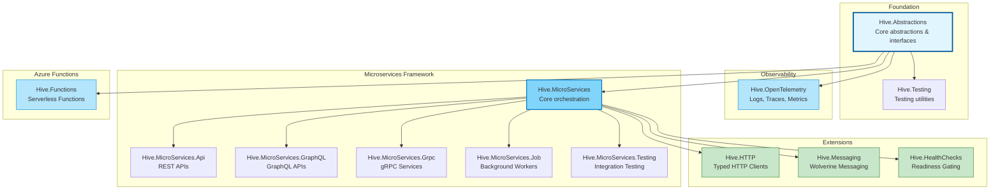

# Hive

[](https://dotnet.microsoft.com/download/dotnet/10.0)
[](https://docs.microsoft.com/en-us/dotnet/csharp/)
[](./Version.targets)

An opinionated, extensible microservices framework for .NET 10 that provides a plugin-based architecture for building production-ready services with minimal boilerplate.

---

## Table of Contents

- [Overview](#overview)
- [Key Features](#key-features)
- [Architecture](#architecture)
- [Repository Structure](#repository-structure)
- [Quick Start](#quick-start)
- [Modules](#modules)
- [Building and Testing](#building-and-testing)
- [Documentation](#documentation)
- [Contributing](#contributing)

---

## Overview

Hive is a comprehensive .NET microservices framework that embraces:

- **Extension-based architecture** - All features are implemented as extensions to the core `IMicroService` abstraction
- **Configuration flexibility** - Pre-configuration and post-configuration patterns with validation
- **Multiple hosting models** - REST APIs, GraphQL, gRPC, background jobs, and Azure Functions
- **Production-ready observability** - Built-in OpenTelemetry integration for logs, traces, and metrics
- **Testing utilities** - Comprehensive testing support with xUnit extensions and TestServer integration
- **Kubernetes-ready** - Built-in health probes and lifecycle management

### Design Principles

Hive follows these core principles:

- **KISS** (Keep It Simple, Stupid) - Straightforward code that beginners can follow
- **YAGNI** (You Aren't Gonna Need It) - Implement only explicitly defined features
- **SOLID** - Single Responsibility, Open/Closed, Liskov Substitution, Interface Segregation, Dependency Inversion
- **Extension Pattern** - All features are opt-in via extensions
- **Configuration Validation** - Fail fast at startup with detailed error messages

---

## Key Features

### Core Framework
- ✅ **Extension-based architecture** - Plugin all features via `MicroServiceExtension`
- ✅ **Lifecycle management** - Initialize → Start → Stop → Dispose pattern
- ✅ **Configuration validation** - DataAnnotations, FluentValidation, and custom delegates
- ✅ **Pre/Post configuration** - Configure before or after IServiceProvider is built
- ✅ **Kubernetes integration** - Built-in `/startup`, `/readiness`, `/liveness` probes

### Hosting Models
- ✅ **REST APIs** - Minimal APIs and traditional MVC controllers
- ✅ **GraphQL** - HotChocolate integration
- ✅ **gRPC** - Standard protobuf-first and code-first approaches
- ✅ **Background Jobs** - Worker services and scheduled tasks
- ✅ **Azure Functions** - Azure Functions Worker integration ([docs](./hive.functions/README.md))

### Observability
- ✅ **OpenTelemetry** - Unified logging, tracing, and metrics
- ✅ **OTLP export** - Send telemetry to OpenTelemetry collectors
- ✅ **Resource attributes** - Automatic service identification
- ✅ **Automatic instrumentation** - ASP.NET Core, HTTP Client, Runtime metrics

### Developer Experience
- ✅ **Testing utilities** - xUnit attributes, port providers, test extensions
- ✅ **TestServer integration** - In-memory integration testing
- ✅ **Environment-aware** - Different configs per environment
- ✅ **Centralized package management** - All versions in Directory.Packages.props

---

## Architecture



---

## Repository Structure

Hive is organized as a monorepo with distinct modules:

```
hive/
├── hive.core/                          # Foundation layer
│   ├── src/
│   │   ├── Hive.Abstractions/         # Core abstractions & interfaces
│   │   └── Hive.Testing/              # Testing utilities
│   └── tests/
│       └── Hive.Abstractions.Tests/
│
├── hive.extensions/                    # Feature extensions
│   ├── src/
│   │   ├── Hive.HTTP/                 # Typed HTTP clients (Refit)
│   │   ├── Hive.HTTP.Testing/         # HTTP testing utilities
│   │   ├── Hive.Messaging/            # Messaging abstractions (Wolverine)
│   │   ├── Hive.Messaging.RabbitMq/   # RabbitMQ transport
│   │   └── Hive.HealthChecks/         # Threshold-based readiness gating
│   └── tests/
│       ├── Hive.HTTP.Tests/
│       ├── Hive.Messaging.Tests/
│       ├── Hive.Messaging.RabbitMq.Tests/
│       └── Hive.HealthChecks.Tests/
│
├── hive.microservices/                 # Microservices framework
│   ├── demo/                           # Demo applications
│   │   ├── Hive.MicroServices.Demo.Api/
│   │   └── Hive.MicroServices.Demo.Aspire/
│   ├── src/
│   │   ├── Hive.MicroServices/        # Core framework
│   │   ├── Hive.MicroServices.Api/    # REST API support
│   │   ├── Hive.MicroServices.GraphQL/
│   │   ├── Hive.MicroServices.Grpc/
│   │   ├── Hive.MicroServices.Job/
│   │   └── Hive.MicroServices.Testing/
│   └── tests/
│       └── Hive.MicroServices.Tests/
│
├── hive.opentelemetry/                 # OpenTelemetry integration
│   ├── src/
│   │   └── Hive.OpenTelemetry/
│   └── tests/
│       └── Hive.OpenTelemetry.Tests/
│
├── hive.functions/                     # Azure Functions integration
│   ├── src/
│   │   └── Hive.Functions/
│   ├── demo/
│   │   └── Hive.Functions.Demo/
│   └── tests/
│       └── Hive.Functions.Tests/
│
├── Directory.Packages.props            # Centralized package versions
├── Directory.Build.props               # Global MSBuild properties
├── Version.targets                     # Version source of truth
├── Hive.sln                           # Solution file
└── README.md                          # This file
```

### Module Naming Convention

Modules follow lowercase naming with dot separators:
- ✅ `hive.core`
- ✅ `hive.extensions`
- ✅ `hive.microservices`
- ✅ `hive.opentelemetry`
- ✅ `hive.functions`

Each module MUST follow the structure:
```
{module-name}/
├── src/        # Source code projects (mandatory)
├── tests/      # Test projects (optional)
└── demo/       # Demo applications (optional)
```

📖 [Complete Repository Policies](./.claude/rules/repository-policies.md)

---

## Quick Start

### Prerequisites

- [.NET 10 SDK](https://dotnet.microsoft.com/download/dotnet/10.0)
- [CloudTek.Build.Tool](https://www.nuget.org/packages/CloudTek.Build.Tool/) (optional, for builds)

### Basic REST API Example

```csharp
using Hive;
using Hive.MicroServices.Api;
using Hive.OpenTelemetry;

var service = new MicroService("hello-api")
    .WithOpenTelemetry()  // Add observability
    .ConfigureApiPipeline(endpoints =>
    {
        endpoints.MapGet("/", () => "Hello from Hive!");
        endpoints.MapGet("/health", () => Results.Ok("Healthy"));
    });

await service.RunAsync();
```

### With Configuration and Services

```csharp
var config = new ConfigurationBuilder()
    .AddJsonFile("appsettings.json")
    .AddEnvironmentVariables()
    .Build();

var service = new MicroService("my-api")
    .WithOpenTelemetry()
    .ConfigureServices((services, configuration) =>
    {
        services.AddSingleton<IMyService, MyService>();
        services.ConfigureValidatedOptions<MyOptions>(
            configuration.GetSection("MyOptions")
        );
    })
    .ConfigureApiPipeline(endpoints =>
    {
        endpoints.MapGet("/api/data", async (IMyService myService) =>
        {
            var data = await myService.GetDataAsync();
            return Results.Ok(data);
        });
    });

await service.RunAsync(config);
```

### Running the Demo

```bash
# Clone the repository
git clone https://github.com/cloud-tek/hive.git
cd hive

# Run the API demo
dotnet run --project hive.microservices/demo/Hive.MicroServices.Demo.Api

# Or run all demos via Aspire
dotnet run --project hive.microservices/demo/Hive.MicroServices.Demo.Aspire
```

---

## Modules

### [hive.core](./hive.core/)

Foundation layer providing core abstractions and testing utilities.

**Packages:**
- [Hive.Abstractions](./hive.core/src/Hive.Abstractions/) - Core abstractions, configuration patterns, extension base classes
- [Hive.Testing](./hive.core/src/Hive.Testing/) - xUnit attributes, test extensions, port providers

**Key Features:**
- `IMicroServiceCore` and `IMicroService` interfaces
- `MicroServiceExtension<T>` base class with compile-time safety
- Pre/post configuration patterns with validation
- Test categorization attributes via CloudTek.Testing ([UnitTest], [IntegrationTest], etc.)

📖 [Read Full Documentation](./hive.core/readme.md)

---

### [hive.extensions](./hive.extensions/)

Feature extensions for messaging, HTTP clients, and health checks.

**Packages:**
- [Hive.HTTP](./hive.extensions/src/Hive.HTTP/) - Typed HTTP clients with Refit, resilience, and telemetry
- [Hive.HTTP.Testing](./hive.extensions/src/Hive.HTTP.Testing/) - HTTP client testing utilities
- [Hive.Messaging](./hive.extensions/src/Hive.Messaging/) - Messaging abstractions built on Wolverine
- [Hive.Messaging.RabbitMq](./hive.extensions/src/Hive.Messaging.RabbitMq/) - RabbitMQ transport for Hive.Messaging
- [Hive.HealthChecks](./hive.extensions/src/Hive.HealthChecks/) - Threshold-based readiness gating with background health monitoring

**Key Features:**
- Typed HTTP clients with authentication, circuit breakers, and telemetry
- Wolverine-based messaging with readiness middleware
- Health check registry with configurable thresholds and startup gating
- Cross-extension tracing via `IActivitySourceProvider`

📖 [Read Full Documentation](./hive.extensions/README.md)

---

### [hive.microservices](./hive.microservices/)

Comprehensive microservices framework with multiple hosting models.

**Packages:**
- [Hive.MicroServices](./hive.microservices/src/Hive.MicroServices/) - Core orchestration
- [Hive.MicroServices.Api](./hive.microservices/src/Hive.MicroServices.Api/) - REST APIs
- [Hive.MicroServices.GraphQL](./hive.microservices/src/Hive.MicroServices.GraphQL/) - GraphQL support
- [Hive.MicroServices.Grpc](./hive.microservices/src/Hive.MicroServices.Grpc/) - gRPC services
- [Hive.MicroServices.Job](./hive.microservices/src/Hive.MicroServices.Job/) - Background workers
- [Hive.MicroServices.Testing](./hive.microservices/src/Hive.MicroServices.Testing/) - TestServer integration

**Key Features:**
- Extension-based architecture
- Multiple pipeline modes (Api, GraphQL, gRPC, Job)
- Built-in CORS support with validation
- Kubernetes probe endpoints
- Lifecycle management (Initialize → Start → Stop → Dispose)

📖 [Read Full Documentation](./hive.microservices/README.md)

---

### [hive.opentelemetry](./hive.opentelemetry/)

OpenTelemetry integration for production-ready observability.

**Packages:**
- [Hive.OpenTelemetry](./hive.opentelemetry/src/Hive.OpenTelemetry/) - Unified logs, traces, and metrics

**Key Features:**
- Zero-configuration defaults
- Declarative configuration via appsettings.json
- OTLP export to OpenTelemetry collectors
- Automatic instrumentation (ASP.NET Core, HTTP Client, Runtime)
- Resource attributes with service identification
- Environment-aware configuration

**Example:**
```csharp
var service = new MicroService("my-service")
    .WithOpenTelemetry()  // That's it!
    .ConfigureApiPipeline(app => { });
```

📖 [Read Full Documentation](./hive.opentelemetry/README.md)

---

### [hive.functions](./hive.functions/)

Azure Functions integration following the same extension pattern.

**Packages:**
- [Hive.Functions](./hive.functions/src/Hive.Functions/) - Azure Functions Worker integration with Hive framework

**Key Features:**
- `IFunctionHost` implementing `IMicroServiceCore`
- Extension-based architecture (OpenTelemetry, configuration validation)
- Native Azure Functions Worker support
- HTTP, Timer, Queue, and Blob triggers
- Automatic Application Insights integration

📖 [Read Full Documentation](./hive.functions/README.md)
📖 [Read Design Document](./HIVE_FUNCTIONS_DESIGN.md)

---

## Building and Testing

### Using CloudTek.Build.Tool (Recommended)

```bash
# Install the build tool (if not already installed)
dotnet tool install CloudTek.Build.Tool

# Run complete build (all targets)
dotnet tool run cloudtek-build --target All

# Quick build (skip checks)
dotnet tool run cloudtek-build --target All --Skip RunChecks
```

### Using dotnet CLI

```bash
# Build entire solution
dotnet build Hive.sln

# Build specific configuration
dotnet build -c Release

# Run all tests
dotnet test Hive.sln

# Run tests by category
dotnet test --filter Category=UnitTests
dotnet test --filter Category=IntegrationTests

# Run specific test
dotnet test --filter FullyQualifiedName~MyTestClass.MyTestMethod
```

### Test Categories

Hive uses custom xUnit attributes for test categorization:

| Attribute | Category | Use Case |
|-----------|----------|----------|
| `[UnitTest]` | UnitTests | Fast, isolated unit tests |
| `[IntegrationTest]` | IntegrationTests | Integration tests with dependencies |
| `[ModuleTest]` | ModuleTests | Module-level tests |
| `[SmokeTest]` | SmokeTests | Quick validation tests |
| `[SystemTest]` | SystemTests | End-to-end system tests |

---

## Documentation

### Project Documentation

- [CLAUDE.md](./CLAUDE.md) - Comprehensive project guide for Claude Code
- [Version.targets](./Version.targets) - Version source of truth (10.0.0)
- [Repository Policies](./.claude/rules/repository-policies.md) - Module structure and naming conventions
- [.NET Artifacts](./.claude/rules/dotnet-artifacts.md) - Package and versioning rules
- [General Principles](./.claude/rules/general-principles.md) - KISS, YAGNI, SOLID

### Module Documentation

- [hive.core/readme.md](./hive.core/readme.md) - Foundation layer documentation
- [hive.extensions/README.md](./hive.extensions/README.md) - Extensions module (HTTP, Messaging, HealthChecks)
- [hive.microservices/README.md](./hive.microservices/README.md) - Microservices framework guide
- [hive.functions/README.md](./hive.functions/README.md) - Azure Functions integration guide
- [hive.opentelemetry/README.md](./hive.opentelemetry/README.md) - OpenTelemetry integration guide
- [hive.microservices/CORS/README.md](./hive.microservices/src/Hive.MicroServices/CORS/README.md) - CORS configuration guide

### Design Documents

- [HIVE_FUNCTIONS_DESIGN.md](./HIVE_FUNCTIONS_DESIGN.md) - Azure Functions integration design (Draft)
- [CORS_EXTRACTION_ANALYSIS.md](./CORS_EXTRACTION_ANALYSIS.md) - CORS abstraction analysis
- [hive.opentelemetry/CONFIGURATION_STRATEGY.md](./hive.opentelemetry/CONFIGURATION_STRATEGY.md) - OpenTelemetry configuration strategy

---

## Development Workflow

### Creating a New Extension

```csharp
public class MyExtension : MicroServiceExtension<MyExtension>
{
    public MyExtension(IMicroServiceCore service) : base(service)
    {
        // Configure during construction
        ConfigureActions.Add((services, config) =>
        {
            services.AddSingleton<IMyService, MyService>();
        });
    }

    public override IServiceCollection ConfigureServices(
        IServiceCollection services, IMicroServiceCore microservice)
    {
        // Additional service configuration
        return services;
    }

    public override IApplicationBuilder Configure(
        IApplicationBuilder app, IMicroServiceCore microservice)
    {
        app.UseMiddleware<MyMiddleware>();
        return app;
    }

    public override IEndpointRouteBuilder ConfigureEndpoints(
        IEndpointRouteBuilder builder)
    {
        builder.MapGet("/my-endpoint", () => "Hello!");
        return builder;
    }
}

// Usage
var service = new MicroService("my-service")
    .RegisterExtension<MyExtension>()
    .ConfigureApiPipeline(endpoints => { });
```

### Adding a New Module

When creating a new module:

1. Create module folder with lowercase naming: `hive.mymodule/`
2. Follow mandatory structure:
   ```
   hive.mymodule/
   ├── src/          # Source code projects (MANDATORY)
   ├── tests/        # Test projects (optional)
   └── demo/         # Demo applications (optional)
   ```
3. Add projects to `Hive.sln`
4. Use centralized versioning via `Version.targets`
5. Update `Directory.Packages.props` for new NuGet dependencies

📖 [Complete Guidelines](./.claude/rules/repository-policies.md)

---

## Dependency Management

Hive uses centralized package management:

- **Version Source of Truth**: [Version.targets](./Version.targets) (current: `10.0.0`)
- **Package Versions**: [Directory.Packages.props](./Directory.Packages.props)
- **Global Properties**: [Directory.Build.props](./Directory.Build.props)
- **Custom MSBuild SDK**: `CloudTek.Sdk` (version 10.0.0-beta.5)

### Adding a New Package

1. Add version to `Directory.Packages.props`:
   ```xml
   <PackageVersion Include="Newtonsoft.Json" Version="13.0.3" />
   ```

2. Reference in project WITHOUT version:
   ```xml
   <PackageReference Include="Newtonsoft.Json" />
   ```

---

## Kubernetes Deployment

All Hive microservices include built-in Kubernetes support:

```yaml
apiVersion: apps/v1
kind: Deployment
metadata:
  name: my-hive-service
spec:
  template:
    spec:
      containers:
      - name: app
        image: my-hive-service:latest
        ports:
        - containerPort: 8080
        env:
        - name: ASPNETCORE_ENVIRONMENT
          value: "Production"
        - name: OTEL_EXPORTER_OTLP_ENDPOINT
          value: "http://otel-collector:4317"
        startupProbe:
          httpGet:
            path: /startup
            port: 8080
          failureThreshold: 30
          periodSeconds: 10
        livenessProbe:
          httpGet:
            path: /liveness
            port: 8080
          periodSeconds: 10
        readinessProbe:
          httpGet:
            path: /readiness
            port: 8080
          periodSeconds: 5
```

---

## Contributing

This is a monorepo project. When contributing:

1. **Follow Repository Policies** - See [.claude/rules/repository-policies.md](./.claude/rules/repository-policies.md)
2. **Use Test Attributes** - Categorize tests with `[UnitTest]`, `[IntegrationTest]`, etc.
3. **Follow SOLID Principles** - Keep code simple, extensible, and maintainable
4. **Validate Configuration** - Always validate configuration with FluentValidation or DataAnnotations
5. **Write Tests** - All features require unit and integration tests
6. **Update Documentation** - Keep README files synchronized with code changes

### Git Workflow

```bash
# Create feature branch
git checkout -b feature/my-feature

# Make changes and commit
git add .
git commit -m "feat: add my feature"

# Run tests before pushing
dotnet test Hive.sln

# Push and create PR
git push origin feature/my-feature
```

---

## License

[Check Repository License]

---

## Repository

- **GitHub**: https://github.com/cloud-tek/hive
- **Target Framework**: .NET 10.0
- **C# Version**: 14
- **Current Version**: 10.0.0

---

## Support

For issues, questions, or feature requests:

- Open an issue on [GitHub Issues](https://github.com/cloud-tek/hive/issues)
- Refer to module-specific documentation linked above
- Check the [CLAUDE.md](./CLAUDE.md) for detailed project information

---

**Built with ❤️ using .NET 10 and C# 14**
