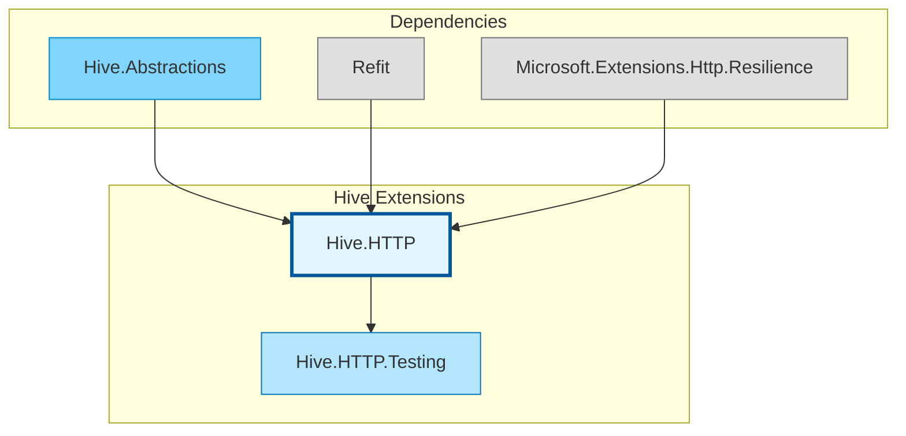

# Hive Extensions

Cross-cutting extensions for Hive microservices, providing standardized infrastructure capabilities as composable building blocks.

## Architecture



## Module Contents

### [Hive.HTTP](src/Hive.HTTP/)

Standardized HTTP client support for inter-service and external API communication. Provides Refit-based typed clients with built-in authentication, resilience, and telemetry.

[Read Full Documentation](src/Hive.HTTP/README.md)

### [Hive.HTTP.Testing](src/Hive.HTTP.Testing/)

Testing utilities for Hive.HTTP clients. Enables test handler injection and mock response factories for integration testing without real HTTP calls.

## Module Structure

```
hive.extensions/
├── src/
│   ├── Hive.HTTP/                # HTTP client extension
│   └── Hive.HTTP.Testing/        # Testing support
└── tests/
    └── Hive.HTTP.Tests/          # Test suite
```

## Package Information

| Package | Description | Key Dependencies |
|---------|-------------|------------------|
| `Hive.HTTP` | Typed HTTP clients with auth, resilience, and telemetry | Refit, Microsoft.Extensions.Http.Resilience |
| `Hive.HTTP.Testing` | Test handler injection and mock responses | Hive.HTTP |
