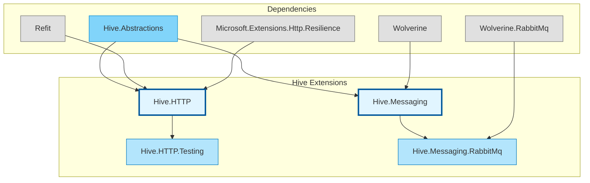

# Hive Extensions

Cross-cutting extensions for Hive microservices, providing standardized infrastructure capabilities as composable building blocks.

## Architecture



## Module Contents

### [Hive.HTTP](src/Hive.HTTP/)

Standardized HTTP client support for inter-service and external API communication. Provides Refit-based typed clients with built-in authentication, resilience, and telemetry. Works with both `MicroService` and `FunctionHost` (Azure Functions).

[Read Full Documentation](src/Hive.HTTP/README.md)

### [Hive.HTTP.Testing](src/Hive.HTTP.Testing/)

Testing utilities for Hive.HTTP clients. Enables test handler injection and mock response factories for integration testing without real HTTP calls.

### [Hive.Messaging](src/Hive.Messaging/)

Opinionated messaging extension built on Wolverine. Provides a fluent builder API for declaring queue listeners and publish routes, with built-in readiness gating, handler telemetry, and distributed tracing. Supports full messaging (handling + sending) on `IMicroService` and send-only on `IMicroServiceCore` (Azure Functions).

[Read Full Documentation](src/Hive.Messaging/README.md)

### [Hive.Messaging.RabbitMq](src/Hive.Messaging.RabbitMq/)

RabbitMQ transport provider for Hive.Messaging. Bridges Hive configuration to Wolverine's RabbitMQ transport with support for named brokers, auto-provisioning, and health checks.

## Module Structure

```
hive.extensions/
├── src/
│   ├── Hive.HTTP/                # HTTP client extension
│   ├── Hive.HTTP.Testing/        # HTTP testing support
│   ├── Hive.Messaging/           # Messaging extension (Wolverine)
│   └── Hive.Messaging.RabbitMq/  # RabbitMQ transport provider
└── tests/
    ├── Hive.HTTP.Tests/          # HTTP test suite
    └── Hive.Messaging.Tests/     # Messaging test suite
```

## Package Information

| Package | Description | Key Dependencies |
|---------|-------------|------------------|
| `Hive.HTTP` | Typed HTTP clients with auth, resilience, and telemetry | Refit, Microsoft.Extensions.Http.Resilience |
| `Hive.HTTP.Testing` | Test handler injection and mock responses | Hive.HTTP |
| `Hive.Messaging` | Message handling and sending with readiness gating and telemetry | Wolverine |
| `Hive.Messaging.RabbitMq` | RabbitMQ transport for Hive.Messaging | Wolverine.RabbitMq, RabbitMQ.Client |
