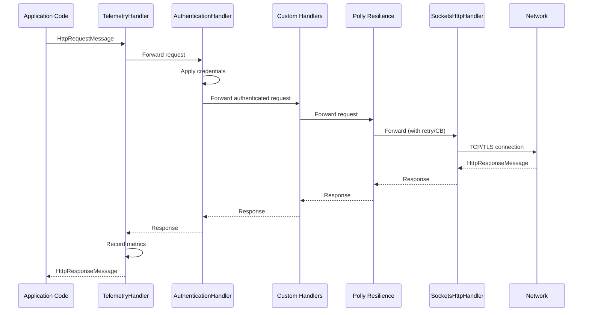

# Hive.HTTP

Standardized HTTP client support for Hive microservices, providing typed Refit clients with built-in authentication, resilience policies, and telemetry.

## Table of Contents

- [Overview](#overview)
- [Quick Start](#quick-start)
- [Internal vs External Clients](#internal-vs-external-clients)
- [Configuration](#configuration)
- [Authentication](#authentication)
- [Resilience](#resilience)
- [Handler Pipeline](#handler-pipeline)
- [Telemetry](#telemetry)
- [Client Library Pattern](#client-library-pattern)
- [Testing](#testing)
- [Configuration Reference](#configuration-reference)
- [Troubleshooting](#troubleshooting)

## Overview

Hive.HTTP wraps [Refit](https://github.com/reactiveui/refit) typed HTTP clients with an opinionated handler pipeline that includes:

- Automatic telemetry (request duration, counts, errors)
- Pluggable authentication (Bearer, API Key, Custom)
- Resilience policies (retry, circuit breaker, timeout) via Polly
- Tiered configuration (JSON config + fluent overrides)
- `SocketsHttpHandler` tuning for connection pooling
- Testing support with handler injection and mock responses

## Quick Start

Define a Refit interface and register it:

```csharp
// 1. Define the API interface
[Headers("Accept: application/json")]
public interface IWeatherApi
{
    [Get("/weatherforecast")]
    Task<WeatherForecast[]> GetWeatherForecast();
}

// 2. Register the client
var service = new MicroService("my-service")
    .WithHttpClient<IWeatherApi>(client => client
        .WithBaseAddress("https+http://weather-service"))
    .ConfigureApiPipeline(app =>
    {
        app.MapGet("/weather", async (IWeatherApi api) =>
            await api.GetWeatherForecast());
    });

await service.RunAsync();
```

The `IWeatherApi` interface is resolved from DI and all requests flow through the handler pipeline automatically.

## Internal vs External Clients

Hive.HTTP distinguishes between internal (service-to-service) and external (third-party API) clients:

| Aspect | Internal | External |
|--------|----------|----------|
| **Purpose** | Service-to-service within your infrastructure | Third-party or public APIs |
| **Base Address** | Service discovery URIs (`https+http://service-name`) | Full URLs (`https://api.example.com`) |
| **Authentication** | Typically bearer tokens from shared identity | API keys, OAuth client credentials |
| **Resilience** | Aggressive retries, fast timeouts | Conservative retries, longer timeouts |
| **Default** | Yes (default flavour) | Must be explicitly set |

### Internal Client

```csharp
service.WithHttpClient<IOrderApi>(client => client
    .Internal()  // default, can be omitted
    .WithBaseAddress("https+http://order-service"));
```

### External Client

```csharp
service.WithHttpClient<IPaymentGateway>(client => client
    .External()
    .WithBaseAddress("https://api.stripe.com")
    .WithAuthentication(auth => auth.ApiKey("Authorization", "Bearer sk_live_...")));
```

The flavour is informational and can be used for environment-specific configuration overrides.

## Configuration

Hive.HTTP uses a tiered configuration model where JSON configuration provides base values and fluent API calls override them.

**Priority:** IConfiguration < Fluent API (fluent wins)

### JSON Configuration

```json
{
  "Hive": {
    "Http": {
      "IWeatherApi": {
        "BaseAddress": "https+http://weather-service",
        "Flavour": "Internal",
        "Resilience": {
          "MaxRetries": 3,
          "PerAttemptTimeout": "00:00:10",
          "CircuitBreaker": {
            "Enabled": true,
            "FailureRatio": 0.5,
            "SamplingDuration": "00:00:30",
            "MinimumThroughput": 10,
            "BreakDuration": "00:00:30"
          }
        },
        "Authentication": {
          "Type": "ApiKey",
          "HeaderName": "X-Api-Key",
          "Value": "my-api-key"
        },
        "SocketsHandler": {
          "PooledConnectionLifetime": "Infinite",
          "PooledConnectionIdleTimeout": "00:01:00",
          "MaxConnectionsPerServer": 2147483647
        }
      }
    }
  }
}
```

The section key under `Hive:Http` matches the client name (defaults to the interface type name, e.g., `IWeatherApi`).

### Fluent API

```csharp
service.WithHttpClient<IWeatherApi>(client => client
    .Internal()
    .WithBaseAddress("https+http://weather-service")
    .WithAuthentication(auth => auth.BearerToken(sp =>
    {
        var tokenService = sp.GetRequiredService<ITokenService>();
        return ct => tokenService.GetTokenAsync(ct);
    }))
    .WithResilience(r => r.UseStandardResilience())
    .WithHandler<MyCustomHandler>()
    .WithRefitSettings(new RefitSettings
    {
        ContentSerializer = new SystemTextJsonContentSerializer()
    }));
```

### Environment-Specific Overrides

Use standard ASP.NET Core configuration layering:

```json
// appsettings.Development.json
{
  "Hive": {
    "Http": {
      "IWeatherApi": {
        "BaseAddress": "http://localhost:5001"
      }
    }
  }
}
```

```json
// appsettings.Production.json
{
  "Hive": {
    "Http": {
      "IWeatherApi": {
        "BaseAddress": "https+http://weather-service"
      }
    }
  }
}
```

## Authentication

Hive.HTTP supports three authentication strategies via the fluent API and one via JSON configuration.

### Bearer Token

Uses a factory delegate to obtain tokens dynamically. The factory receives an `IServiceProvider` and returns a function that produces tokens per-request:

```csharp
client.WithAuthentication(auth => auth.BearerToken(sp =>
{
    var tokenService = sp.GetRequiredService<ITokenService>();
    return ct => tokenService.GetTokenAsync(ct);
}));
```

The token factory is invoked on every request, enabling token refresh. If the factory returns a null or empty token, an `InvalidOperationException` is thrown.

### API Key

Static header-based authentication:

```csharp
client.WithAuthentication(auth => auth.ApiKey("X-Api-Key", "my-secret-key"));
```

This adds the specified header to every outgoing request.

### Custom Provider

Implement `IAuthenticationProvider` for advanced scenarios (e.g., OAuth client credentials, HMAC signing):

```csharp
public class OAuth2Provider : IAuthenticationProvider
{
    public async Task ApplyAsync(HttpRequestMessage message, CancellationToken cancellationToken)
    {
        // Custom authentication logic
        var token = await GetOAuth2TokenAsync(cancellationToken);
        message.Headers.Authorization = new AuthenticationHeaderValue("Bearer", token);
    }
}

// Register via factory
client.WithAuthentication(auth => auth.Custom(sp =>
    new OAuth2Provider(sp.GetRequiredService<ITokenCache>())));
```

### Configuration-Only Authentication

API Key authentication can be configured entirely via JSON without fluent API calls:

```json
{
  "Hive": {
    "Http": {
      "IExternalApi": {
        "BaseAddress": "https://api.example.com",
        "Authentication": {
          "Type": "ApiKey",
          "HeaderName": "X-Api-Key",
          "Value": "your-api-key"
        }
      }
    }
  }
}
```

```csharp
// No authentication setup needed in code
service.WithHttpClient<IExternalApi>();
```

## Resilience

Resilience policies are powered by [Polly](https://github.com/App-vNext/Polly) via `Microsoft.Extensions.Http.Resilience`.

### Standard Preset

Applies retry (3 attempts), circuit breaker, and per-attempt timeout:

```csharp
client.WithResilience(r => r.UseStandardResilience());
```

Standard preset values:
- **Retry**: 3 max attempts
- **Timeout**: 10s per attempt
- **Circuit Breaker**: 10% failure ratio, 30s sampling window, 10 minimum throughput, 30s break duration

### Custom Configuration

```csharp
client.WithResilience(r => r
    .WithRetry(5)
    .WithTimeout(TimeSpan.FromSeconds(30))
    .WithCircuitBreaker(
        failureRatio: 0.2,
        samplingDuration: TimeSpan.FromMinutes(1),
        minimumThroughput: 20,
        breakDuration: TimeSpan.FromSeconds(15)));
```

### JSON Configuration

```json
{
  "Hive": {
    "Http": {
      "IWeatherApi": {
        "Resilience": {
          "MaxRetries": 5,
          "PerAttemptTimeout": "00:00:30",
          "CircuitBreaker": {
            "Enabled": true,
            "FailureRatio": 0.2,
            "SamplingDuration": "00:01:00",
            "MinimumThroughput": 20,
            "BreakDuration": "00:00:15"
          }
        }
      }
    }
  }
}
```

## Handler Pipeline

Every HTTP request passes through a layered handler pipeline:



**Handler order (outermost to innermost):**

1. **TelemetryHandler** — Records request duration, counts, errors, and exception types
2. **AuthenticationHandler** — Applies Bearer token, API key, or custom authentication
3. **Custom Handlers** — User-registered `DelegatingHandler` instances (via `WithHandler<T>()`)
4. **Polly Resilience** — Retry, circuit breaker, and timeout policies
5. **SocketsHttpHandler** — Connection pooling and transport

## Telemetry

Hive.HTTP emits metrics via `System.Diagnostics.Metrics` under the meter name `Hive.HTTP`.

### Instruments

| Instrument | Type | Unit | Description |
|------------|------|------|-------------|
| `hive.http.client.request.duration` | Histogram | ms | Request duration in milliseconds |
| `hive.http.client.request.count` | Counter | — | Total requests |
| `hive.http.client.request.errors` | Counter | — | Non-success or failed requests |
| `hive.http.client.resilience.retries` | Counter | — | Total retry attempts |
| `hive.http.client.resilience.circuit_breaker.state` | Counter | — | Circuit breaker state transitions |

### Tag Dimensions

All request metrics include:

| Tag | Description |
|-----|-------------|
| `service.name` | The Hive microservice name |
| `http.request.method` | HTTP method (GET, POST, etc.) |
| `server.address` | Target host |
| `http.response.status_code` | Response status code or "error" |
| `client.name` | Registered client name |
| `error.type` | Exception type name (only on failure) |

## Client Library Pattern

For reusable inter-service communication, encapsulate the Refit interface, models, and registration in a dedicated client assembly. Consumers reference the client package without depending on Hive.HTTP directly.

### Client Library Structure

```
MyService.Client/
├── IMyServiceApi.cs          # Refit interface
├── Models/                    # Shared DTOs
│   └── WeatherForecast.cs
└── Startup.cs                 # Extension method
```

### Example

**Refit Interface:**
```csharp
[Headers("Accept: application/json")]
public interface IWeatherForecastApi
{
    [Get("/weatherforecast")]
    Task<WeatherForecast[]> GetWeatherForecast();
}
```

**Startup Extension:**
```csharp
public static class Startup
{
    public static IMicroService WithWeatherForecastApiClient(this IMicroService service)
    {
        service.WithHttpClient<IWeatherForecastApi>(client => client.Internal());
        return service;
    }

    public static IMicroServiceCore WithWeatherForecastApiClient(this IMicroServiceCore service)
    {
        service.WithHttpClient<IWeatherForecastApi>(client => client.Internal());
        return service;
    }
}
```

**Consumer:**
```csharp
var service = new MicroService("api-gateway")
    .WithWeatherForecastApiClient()  // One-liner, no Hive.HTTP knowledge needed
    .ConfigureApiPipeline(app =>
    {
        app.MapGet("/weather", async (IWeatherForecastApi api) =>
            await api.GetWeatherForecast());
    });
```

The consumer only references the client assembly. Base address, resilience, and authentication are configured via JSON or within the client library itself.

## Testing

`Hive.HTTP.Testing` provides utilities to replace the real HTTP transport during integration tests.

### WithTestHandler

Inject a custom `HttpMessageHandler` for complete control:

```csharp
var handler = new MockHttpMessageHandler(request =>
    new HttpResponseMessage(HttpStatusCode.OK)
    {
        Content = new StringContent("[{\"date\":\"2025-01-01\",\"temperatureC\":25}]")
    });

var service = new MicroService("test-service")
    .WithHttpClient<IWeatherApi>(client =>
        client.WithBaseAddress("http://localhost"))
    .WithTestHandler<IWeatherApi>(handler)
    .ConfigureApiPipeline(app => { /* ... */ });
```

### WithMockResponse

Shorthand for providing a response factory without creating a handler:

```csharp
var service = new MicroService("test-service")
    .WithHttpClient<IWeatherApi>(client =>
        client.WithBaseAddress("http://localhost"))
    .WithMockResponse<IWeatherApi>(request =>
        new HttpResponseMessage(HttpStatusCode.OK)
        {
            Content = JsonContent.Create(new[] { new WeatherForecast(DateTime.Now, 25, "Warm") })
        })
    .ConfigureApiPipeline(app => { /* ... */ });
```

Both methods replace the `SocketsHttpHandler` with the provided handler, while the rest of the pipeline (telemetry, authentication, custom handlers, resilience) remains active.

## Configuration Reference

### HttpClientOptions (`Hive:Http:{ClientName}`)

| Property | Type | Default | Description |
|----------|------|---------|-------------|
| `BaseAddress` | `string?` | `null` | Base URL for all requests (required) |
| `Flavour` | `HttpClientFlavour` | `Internal` | Client type: `Internal` or `External` |
| `Resilience` | `ResilienceOptions` | *(see below)* | Resilience policy configuration |
| `Authentication` | `AuthenticationOptions?` | `null` | Authentication configuration |
| `SocketsHandler` | `SocketsHandlerOptions` | *(see below)* | Connection pooling configuration |

### ResilienceOptions

| Property | Type | Default | Description |
|----------|------|---------|-------------|
| `MaxRetries` | `int?` | `null` | Maximum retry attempts (null = no retries) |
| `PerAttemptTimeout` | `TimeSpan?` | `null` | Timeout per attempt (null = no timeout) |
| `CircuitBreaker` | `CircuitBreakerOptions?` | `null` | Circuit breaker settings |

### CircuitBreakerOptions

| Property | Type | Default | Description |
|----------|------|---------|-------------|
| `Enabled` | `bool` | `false` | Enable circuit breaker |
| `FailureRatio` | `double` | `0.5` | Failure ratio to trip the breaker |
| `SamplingDuration` | `TimeSpan` | `30s` | Time window for failure sampling |
| `MinimumThroughput` | `int` | `10` | Minimum requests before breaker can trip |
| `BreakDuration` | `TimeSpan` | `30s` | Duration the circuit stays open |

### AuthenticationOptions

| Property | Type | Default | Description |
|----------|------|---------|-------------|
| `Type` | `string` | *(required)* | Authentication type: `ApiKey`, `BearerToken`, `Custom` |
| `HeaderName` | `string?` | `null` | Header name (for ApiKey type) |
| `Value` | `string?` | `null` | Header value (for ApiKey type) |

### SocketsHandlerOptions

| Property | Type | Default | Description |
|----------|------|---------|-------------|
| `PooledConnectionLifetime` | `TimeSpan` | `Infinite` | How long a connection can live in the pool |
| `PooledConnectionIdleTimeout` | `TimeSpan` | `1 minute` | How long an idle connection stays in the pool |
| `MaxConnectionsPerServer` | `int` | `2147483647` | Maximum concurrent connections per server |

All `SocketsHandlerOptions` defaults match the .NET framework defaults.

## Troubleshooting

### Missing BaseAddress

**Error:** `Validation failed for client 'IWeatherApi': BaseAddress is required`

The client has no base address from either JSON config or fluent API. Add one:
```csharp
client.WithBaseAddress("https+http://weather-service")
```
Or in configuration:
```json
{ "Hive": { "Http": { "IWeatherApi": { "BaseAddress": "https+http://weather-service" } } } }
```

### Bearer Token Factory Returns Null

**Error:** `InvalidOperationException: Bearer token factory returned a null or empty token.`

The `Func<CancellationToken, Task<string>>` returned null or an empty string. Ensure your token service is properly configured and can produce tokens at request time.

### Authentication Type Mismatch

If JSON config specifies `"Type": "ApiKey"` but also sets up a bearer token via fluent API, the fluent API takes precedence. The `AuthenticationProviderFactory` (set by fluent calls) is checked first; JSON-based `ApiKey` authentication is only used when no provider factory exists.

### Test Handler Not Working

**Error:** `InvalidOperationException: No Hive.HTTP extension found. Call WithHttpClient<T>() before WithTestHandler<T>() or WithMockResponse<T>().`

Ensure `WithHttpClient<TApi>()` is called before `WithTestHandler<TApi>()` or `WithMockResponse<TApi>()`. The test methods need to find the existing HTTP extension to inject the handler override.
