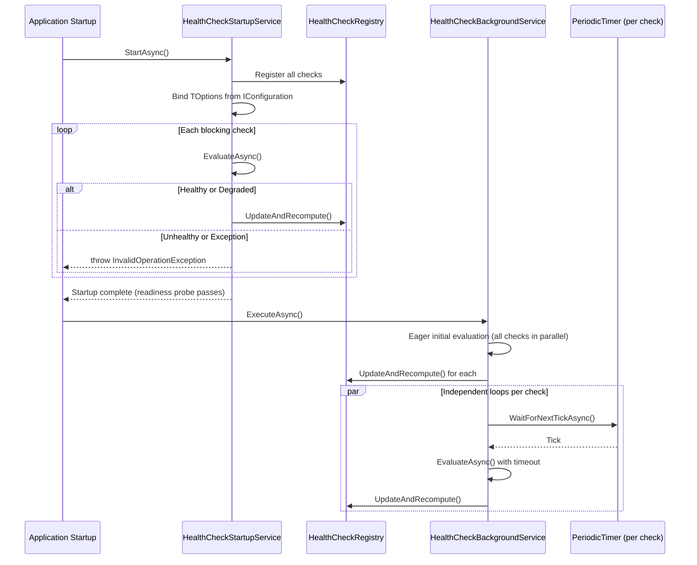

# Hive.HealthChecks

Application-level health check framework for Hive microservices, providing threshold-based readiness gating, per-check timeouts, and distributed tracing.

## Table of Contents

- [Overview](#overview)
- [Quick Start](#quick-start)
- [Creating a Health Check](#creating-a-health-check)
- [Builder API](#builder-api)
- [Configuration](#configuration)
- [Configuration Priority](#configuration-priority)
- [Lifecycle](#lifecycle)
- [Readiness Gating](#readiness-gating)
- [Options Binding](#options-binding)
- [Distributed Tracing](#distributed-tracing)
- [Configuration Reference](#configuration-reference)
- [Related Projects](#related-projects)

## Overview

Hive.HealthChecks provides an application-level health check system that operates independently of ASP.NET's `IHealthCheck` infrastructure. It is designed for Kubernetes deployments where readiness probe semantics require threshold-based evaluation, timeout enforcement, and startup-blocking guarantees.

Key capabilities:

- **Explicit registration** via fluent builder API — no assembly scanning or auto-discovery
- **Failure/success thresholds** — a check must fail N consecutive times before it affects readiness (and recover N times before readiness is restored)
- **Readiness threshold** — configure whether `Degraded` status still counts as passing
- **Per-check timeout** — evaluations that exceed the timeout are marked `Unhealthy` automatically
- **Startup blocking** — checks marked `BlockReadinessProbeOnStartup` are evaluated during startup; failure prevents the service from accepting traffic
- **Eager initial evaluation** — all checks are evaluated once immediately before periodic timers start, so no check remains in `Unknown` status
- **Three-tier configuration priority** — POCO defaults < `IConfiguration` (JSON/env vars) < Builder (explicit code)
- **Distributed tracing** — each evaluation creates an `Activity` under the `Hive.HealthChecks` source, auto-discovered by `Hive.OpenTelemetry`
- **Thread-safe registry** — the central `HealthCheckRegistry` is safe for concurrent reads and writes

## Quick Start

```csharp
using Hive.HealthChecks;
using Hive.Messaging.RabbitMq.HealthChecks;

var service = new MicroService("order-api")
    .WithHealthChecks(builder => builder
        .WithHealthCheck<RabbitMqHealthCheck>())
    .ConfigureApiPipeline(app => { /* ... */ });

await service.RunAsync();
```

With configuration overrides:

```csharp
var service = new MicroService("order-api")
    .WithHealthChecks(builder =>
    {
        builder.Interval = TimeSpan.FromSeconds(15);
        builder.WithHealthCheck<RabbitMqHealthCheck>(options =>
        {
            options.FailureThreshold = 3;
            options.Timeout = TimeSpan.FromSeconds(10);
        });
    })
    .ConfigureApiPipeline(app => { /* ... */ });
```

## Creating a Health Check

Health checks inherit from `HiveHealthCheck` and implement `IHiveHealthCheck`:

```csharp
using Hive.HealthChecks;

public sealed class DatabaseHealthCheck : HiveHealthCheck, IHiveHealthCheck
{
    private readonly IServiceScopeFactory _scopeFactory;

    public static string CheckName => "Database";

    public static void ConfigureDefaults(HiveHealthCheckOptions options)
    {
        options.AffectsReadiness = true;
        options.BlockReadinessProbeOnStartup = true;
        options.FailureThreshold = 3;
        options.Timeout = TimeSpan.FromSeconds(5);
    }

    public DatabaseHealthCheck(IServiceScopeFactory scopeFactory)
    {
        _scopeFactory = scopeFactory;
    }

    public override async Task<HealthCheckStatus> EvaluateAsync(CancellationToken ct)
    {
        await using var scope = _scopeFactory.CreateAsyncScope();
        var db = scope.ServiceProvider.GetRequiredService<AppDbContext>();
        await db.Database.CanConnectAsync(ct);
        return HealthCheckStatus.Healthy;
    }
}
```

### Requirements

Every health check must:

1. Inherit from `HiveHealthCheck` (or `HiveHealthCheck<TOptions>` for configuration binding)
2. Implement `IHiveHealthCheck` which requires:
   - `static string CheckName { get; }` — unique identifier used in configuration paths and snapshots
   - `static void ConfigureDefaults(HiveHealthCheckOptions options)` — sets sensible defaults
3. Override `EvaluateAsync(CancellationToken)` — return `Healthy`, `Degraded`, or `Unhealthy`

Health checks are registered as **singletons** in DI. For scoped dependencies (e.g., `DbContext`), inject `IServiceScopeFactory`.

### Return Values

| Status | Meaning |
|--------|---------|
| `Healthy` | The dependency is fully operational |
| `Degraded` | The dependency is functional but impaired (passes readiness if `ReadinessThreshold = Degraded`) |
| `Unhealthy` | The dependency is not operational |

If `EvaluateAsync` throws an exception, the check is automatically recorded as `Unhealthy` with the exception message stored in the `Error` field. If the evaluation exceeds the configured `Timeout`, it is cancelled and recorded as `Unhealthy` with a timeout error.

## Builder API

The `HealthChecksBuilder` is received inside `WithHealthChecks()`:

| Member | Description |
|--------|-------------|
| `Interval` | Global evaluation interval (`TimeSpan?`). Overrides `IConfiguration`. Default: `null` (falls back to config or 30s) |
| `WithHealthCheck<T>()` | Register a health check type using its `ConfigureDefaults` |
| `WithHealthCheck<T>(Action<HiveHealthCheckOptions>)` | Register with a per-check configuration callback |

### Example

```csharp
builder
    .WithHealthCheck<RabbitMqHealthCheck>()
    .WithHealthCheck<DatabaseHealthCheck>(options =>
    {
        options.AffectsReadiness = false;        // Informational only
        options.BlockReadinessProbeOnStartup = false;
    });
```

Registering the same check type twice throws `InvalidOperationException`.

## Configuration

Hive.HealthChecks supports configuration via `IConfiguration` (JSON/environment variables) and the fluent builder API.

### JSON Configuration

```json
{
  "Hive": {
    "HealthChecks": {
      "Interval": 15,
      "Checks": {
        "RabbitMq": {
          "AffectsReadiness": true,
          "BlockReadinessProbeOnStartup": true,
          "ReadinessThreshold": "Degraded",
          "FailureThreshold": 3,
          "SuccessThreshold": 1,
          "Timeout": 10,
          "Interval": 20
        },
        "Database": {
          "FailureThreshold": 5,
          "Timeout": 5
        }
      }
    }
  }
}
```

### Environment Variables (via Aspire or Kubernetes)

```bash
Hive__HealthChecks__Interval=15
Hive__HealthChecks__Checks__RabbitMq__FailureThreshold=3
Hive__HealthChecks__Checks__RabbitMq__Timeout=10
```

### Configuration Path Convention

```
Hive:HealthChecks                              # Global settings
Hive:HealthChecks:Interval                     # Global interval (seconds)
Hive:HealthChecks:Checks:{CheckName}           # Per-check overrides (keyed by CheckName)
Hive:HealthChecks:Checks:{CheckName}:Options   # TOptions binding (for HiveHealthCheck<TOptions>)
```

Where `{CheckName}` is the value returned by the check's `static string CheckName` property (e.g., `"RabbitMq"`, `"Database"`).

## Configuration Priority

Options are resolved using a three-tier priority system where later tiers override earlier ones:

```
1. POCO defaults        ConfigureDefaults() or HiveHealthCheckOptions constructor defaults
       ↓ overridden by
2. IConfiguration       JSON/environment variables at Hive:HealthChecks:Checks:{CheckName}
       ↓ overridden by
3. Builder (explicit)   WithHealthCheck<T>(options => { ... }) callback
```

For the global `Interval`:

```
1. Default (30s)        HealthChecksOptions.Interval default
       ↓ overridden by
2. IConfiguration       Hive:HealthChecks:Interval
       ↓ overridden by
3. Builder              builder.Interval = TimeSpan.FromSeconds(15)
```

Per-check `Interval` (when set) overrides the global interval for that specific check.

## Lifecycle

Health check evaluation happens in two phases:



### Phase 1: Startup Service

1. All checks are registered in the `HealthCheckRegistry`
2. `HiveHealthCheck<TOptions>` instances have their `Options` bound from `IConfiguration`
3. Checks with `BlockReadinessProbeOnStartup = true` are evaluated sequentially
4. If any blocking check returns `Unhealthy` or throws, startup fails with `InvalidOperationException`
5. Non-blocking checks are skipped (they start in `Unknown` status, which does not fail readiness initially)

### Phase 2: Background Service

1. All checks are evaluated once eagerly in parallel (so no check remains `Unknown`)
2. Independent `PeriodicTimer` loops start for each check
3. Each evaluation is wrapped with a linked `CancellationToken` that enforces the per-check `Timeout`
4. Exceptions are caught, logged, and recorded as `Unhealthy` — the loop continues

## Readiness Gating

The `HealthCheckRegistry` implements `IHealthCheckStateProvider`, which the readiness middleware consults. A check's `IsPassingForReadiness` is computed as follows:

### Failure Threshold

When a check fails, `ConsecutiveFailures` increments. The check remains passing until `ConsecutiveFailures >= FailureThreshold`. This prevents transient failures from immediately affecting readiness.

```
FailureThreshold = 3:
  Fail #1  → ConsecutiveFailures=1  → still passing
  Fail #2  → ConsecutiveFailures=2  → still passing
  Fail #3  → ConsecutiveFailures=3  → NOT passing
```

### Success Threshold

When a failed check recovers, `ConsecutiveSuccesses` increments. Readiness is restored once `ConsecutiveSuccesses >= SuccessThreshold`. This prevents a single successful evaluation from prematurely restoring readiness.

```
SuccessThreshold = 3:
  Recovery #1  → ConsecutiveSuccesses=1  → still NOT passing
  Recovery #2  → ConsecutiveSuccesses=2  → still NOT passing
  Recovery #3  → ConsecutiveSuccesses=3  → passing restored
```

### Readiness Threshold

Controls which `HealthCheckStatus` values count as "passing":

| ReadinessThreshold | Healthy | Degraded | Unhealthy | Unknown |
|--------------------|---------|----------|-----------|---------|
| `Degraded` (default) | Pass | Pass | Fail | Fail |
| `Healthy` | Pass | Fail | Fail | Fail |

### AffectsReadiness

When `AffectsReadiness = false`, the check is informational only. Its status is tracked and visible in snapshots but does not influence the readiness probe response.

## Options Binding

For health checks that need custom configuration, extend `HiveHealthCheck<TOptions>`:

```csharp
public sealed class RedisCheckOptions
{
    public string ConnectionString { get; set; } = string.Empty;
    public int DatabaseIndex { get; set; }
}

public sealed class RedisHealthCheck : HiveHealthCheck<RedisCheckOptions>, IHiveHealthCheck
{
    public static string CheckName => "Redis";

    public static void ConfigureDefaults(HiveHealthCheckOptions options)
    {
        options.AffectsReadiness = true;
    }

    public override async Task<HealthCheckStatus> EvaluateAsync(CancellationToken ct)
    {
        // Options.ConnectionString and Options.DatabaseIndex are bound from config
        var redis = await ConnectionMultiplexer.ConnectAsync(Options.ConnectionString);
        var db = redis.GetDatabase(Options.DatabaseIndex);
        await db.PingAsync();
        return HealthCheckStatus.Healthy;
    }
}
```

Configuration:

```json
{
  "Hive": {
    "HealthChecks": {
      "Checks": {
        "Redis": {
          "FailureThreshold": 3,
          "Options": {
            "ConnectionString": "localhost:6379",
            "DatabaseIndex": 0
          }
        }
      }
    }
  }
}
```

The `TOptions` object is bound from `Hive:HealthChecks:Checks:{CheckName}:Options` during startup, before the first evaluation.

## Distributed Tracing

Hive.HealthChecks implements `IActivitySourceProvider` and exposes the `"Hive.HealthChecks"` activity source. When `Hive.OpenTelemetry` is registered, it auto-discovers this source without manual wiring:

```csharp
var service = new MicroService("my-service")
    .WithOpenTelemetry()       // Auto-subscribes to Hive.HealthChecks traces
    .WithHealthChecks(builder => builder
        .WithHealthCheck<RabbitMqHealthCheck>());
```

Each health check evaluation creates an `Activity` named `HealthCheck: {CheckName}` with the following tags:

| Tag | Description |
|-----|-------------|
| `healthcheck.status` | Result status (`Healthy`, `Degraded`, `Unhealthy`) |

On timeout or exception, the activity's status is set to `Error` with a descriptive message.

## Configuration Reference

### HiveHealthCheckOptions (per-check)

Configurable at `Hive:HealthChecks:Checks:{CheckName}` or via the builder callback.

| Property | Type | Default | Description |
|----------|------|---------|-------------|
| `Interval` | `TimeSpan?` | `null` | Per-check interval. Overrides the global interval when set. Config value in seconds |
| `AffectsReadiness` | `bool` | `true` | Whether this check influences the readiness probe |
| `BlockReadinessProbeOnStartup` | `bool` | `true` | Whether to evaluate during startup (failure prevents readiness) |
| `ReadinessThreshold` | `ReadinessThreshold` | `Degraded` | Minimum status to count as passing (`Degraded` or `Healthy`) |
| `FailureThreshold` | `int` | `1` | Consecutive failures before readiness is affected |
| `SuccessThreshold` | `int` | `1` | Consecutive successes required to restore readiness after failure |
| `Timeout` | `TimeSpan` | `30s` | Maximum evaluation duration. Config value in seconds |

### HealthChecksOptions (global)

Configurable at `Hive:HealthChecks`.

| Property | Type | Default | Description |
|----------|------|---------|-------------|
| `Interval` | `TimeSpan` | `30s` | Default evaluation interval for all checks. Config value in seconds |

## Related Projects

- [Hive.Messaging.RabbitMq](../Hive.Messaging.RabbitMq/) — Provides `RabbitMqHealthCheck` as a concrete implementation
- [Hive.OpenTelemetry](../../../hive.opentelemetry/src/Hive.OpenTelemetry/) — Auto-discovers the `Hive.HealthChecks` activity source
- [Hive.Abstractions](../../../hive.core/src/Hive.Abstractions/HealthChecks/) — Core abstractions (`IHiveHealthCheck`, `HiveHealthCheckOptions`, `HealthCheckStatus`, `HealthCheckStateSnapshot`)
