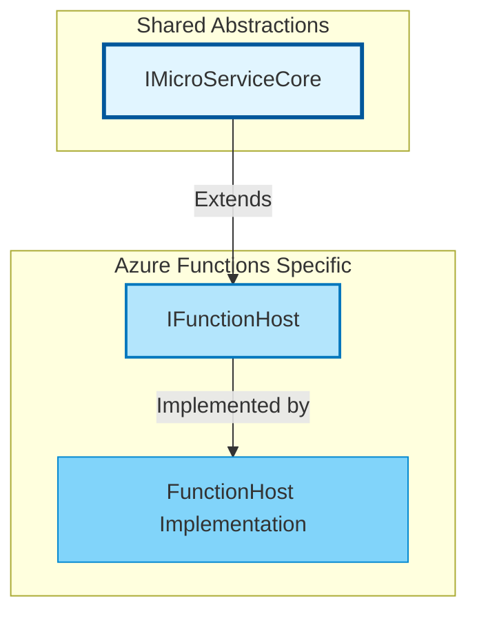
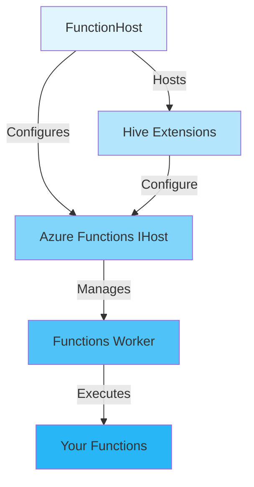
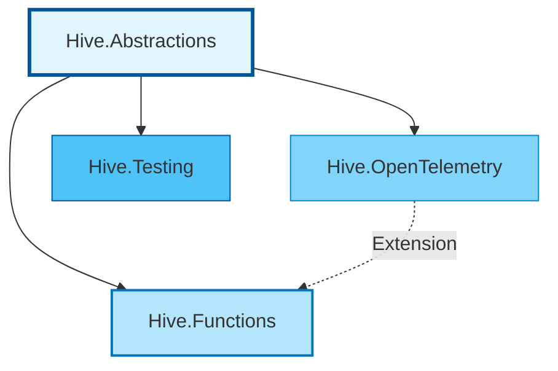

# Hive.Functions

Azure Functions integration for the Hive microservices framework, providing seamless integration with Azure Functions Worker using the familiar Hive extension pattern.

## Table of Contents

- [Overview](#overview)
- [Key Features](#key-features)
- [Architecture](#architecture)
- [Quick Start](#quick-start)
- [Usage Examples](#usage-examples)
- [Configuration](#configuration)
- [Testing](#testing)
- [Comparison with IMicroService](#comparison-with-imicroservice)
- [Related Projects](#related-projects)

---

## Overview

`Hive.Functions` brings the power of the Hive framework to Azure Functions, enabling you to build serverless functions with the same extension-based architecture, configuration patterns, and observability features available in Hive microservices.

### Design Goals

- **Unified Framework**: Use the same `IMicroServiceCore` abstractions across ASP.NET and Azure Functions
- **Extension Compatibility**: Reuse existing Hive extensions (OpenTelemetry, configuration, etc.)
- **Serverless-First**: Optimized for Azure Functions Worker process model
- **Zero Boilerplate**: Minimal setup required to get started
- **Production-Ready**: Built-in Application Insights, configuration validation, and lifecycle management

---

## Key Features

✅ **IMicroServiceCore Integration** - Implements the core Hive abstractions
✅ **Extension System** - Full support for Hive extensions
✅ **OpenTelemetry Support** - Unified observability via `WithOpenTelemetry()`
✅ **Configuration Validation** - Pre/post configuration patterns with validation
✅ **Dependency Injection** - Native Azure Functions DI integration
✅ **Application Insights** - Automatic telemetry collection
✅ **Environment-Aware** - Respects `AZURE_FUNCTIONS_ENVIRONMENT` and `ASPNETCORE_ENVIRONMENT`
✅ **Lifecycle Management** - Proper initialization, startup, and disposal patterns

---

## Architecture

### Interface Hierarchy



### Component Overview



### Core Interfaces

**`IFunctionHost : IMicroServiceCore`** - Azure Functions host with Hive integration
- Inherits all `IMicroServiceCore` properties (Name, Id, Environment, Extensions, etc.)
- `ConfigureServices(Action<IServiceCollection, IConfiguration>)` - Service registration
- `ConfigureFunctions(Action<IFunctionsWorkerApplicationBuilder>)` - Azure Functions configuration
- `RunAsync(CancellationToken)` - Execute the function host

**`FunctionHost`** - Concrete implementation
- Manages Azure Functions Worker host lifecycle
- Integrates configuration (appsettings.json, environment variables)
- Supports extension-based architecture
- Handles proper disposal of resources

---

## Quick Start

### Installation

```bash
# Reference the project in your Azure Functions project
```

```xml
<ItemGroup>
  <ProjectReference Include="path/to/hive.functions/src/Hive.Functions/Hive.Functions.csproj" />
</ItemGroup>
```

### Basic Example

```csharp
using Hive.Functions;
using Microsoft.Extensions.DependencyInjection;

var functionHost = new FunctionHost("my-function-app")
  .ConfigureServices((services, config) =>
  {
    // Register your services
    services.AddSingleton<IMyService, MyService>();
  });

await functionHost.RunAsync();
```

### With OpenTelemetry

```csharp
using Hive.Functions;
using Microsoft.Extensions.DependencyInjection;

var functionHost = new FunctionHost("my-function-app")
  .WithOpenTelemetry()  // Add observability
  .ConfigureServices((services, config) =>
  {
    services.AddSingleton<IWeatherService, WeatherService>();
    services.AddHttpClient();
  });

await functionHost.RunAsync();
```

### Creating Functions

```csharp
using Microsoft.Azure.Functions.Worker;
using Microsoft.Azure.Functions.Worker.Http;
using Microsoft.Extensions.Logging;

public class MyFunctions
{
  private readonly IMyService myService;
  private readonly ILogger<MyFunctions> logger;

  public MyFunctions(IMyService myService, ILogger<MyFunctions> logger)
  {
    this.myService = myService;
    this.logger = logger;
  }

  [Function("ProcessData")]
  public async Task<HttpResponseData> ProcessData(
    [HttpTrigger(AuthorizationLevel.Anonymous, "post", Route = "data")] HttpRequestData req,
    FunctionContext context)
  {
    logger.LogInformation("Processing data request");

    var result = await myService.ProcessAsync();

    var response = req.CreateResponse(HttpStatusCode.OK);
    await response.WriteAsJsonAsync(result);
    return response;
  }
}
```

---

## Usage Examples

### HTTP Trigger Function

```csharp
[Function("GetWeather")]
public async Task<HttpResponseData> GetWeather(
  [HttpTrigger(AuthorizationLevel.Anonymous, "get", Route = "weather/{city}")] HttpRequestData req,
  string city,
  FunctionContext context)
{
  logger.LogInformation("Getting weather for {City}", city);

  var forecast = await weatherService.GetForecastAsync(city);

  var response = req.CreateResponse(HttpStatusCode.OK);
  await response.WriteAsJsonAsync(forecast);
  return response;
}
```

### Timer Trigger Function

```csharp
[Function("WeatherCacheRefresh")]
public async Task WeatherCacheRefresh(
  [TimerTrigger("0 */5 * * * *")] TimerInfo timer,
  FunctionContext context)
{
  logger.LogInformation("Refreshing weather cache at {Time}", DateTime.UtcNow);

  await weatherService.RefreshCacheAsync();

  logger.LogInformation("Next refresh at {Next}", timer.ScheduleStatus?.Next);
}
```

### Queue Trigger Function

```csharp
[Function("ProcessOrder")]
public async Task ProcessOrder(
  [QueueTrigger("orders", Connection = "AzureWebJobsStorage")] string orderJson,
  FunctionContext context)
{
  logger.LogInformation("Processing order: {Order}", orderJson);

  var order = JsonSerializer.Deserialize<Order>(orderJson);
  await orderService.ProcessAsync(order);
}
```

### With Configuration Validation

```csharp
var functionHost = new FunctionHost("my-function-app")
  .WithOpenTelemetry()
  .ConfigureServices((services, config) =>
  {
    // Pre-configure validated options
    services.PreConfigureValidatedOptions<WeatherApiOptions>(
      config,
      () => "WeatherApi");

    // Register services
    services.AddSingleton<IWeatherService, WeatherService>();
    services.AddHttpClient();
  });

await functionHost.RunAsync();
```

---

## Configuration

### Configuration Sources

FunctionHost automatically loads configuration from:

1. `appsettings.json` (optional)
2. `appsettings.{Environment}.json` (optional)
3. `appsettings.shared.json` (optional)
4. Environment variables

### Environment Detection

The function host detects the environment in this order:

1. `AZURE_FUNCTIONS_ENVIRONMENT` (Azure Functions standard)
2. `ASPNETCORE_ENVIRONMENT` (ASP.NET Core standard)
3. Defaults to `"Production"`

### Configuration Example

**appsettings.json:**
```json
{
  "WeatherApi": {
    "ApiKey": "your-api-key",
    "BaseUrl": "https://api.weather.com",
    "TimeoutSeconds": 30
  },
  "Hive": {
    "OpenTelemetry": {
      "OtlpEndpoint": "http://localhost:4317"
    }
  }
}
```

**appsettings.Development.json:**
```json
{
  "Logging": {
    "LogLevel": {
      "Default": "Debug"
    }
  }
}
```

### Configuration Validation

Use Hive's configuration validation patterns:

```csharp
public class WeatherApiOptions
{
  [Required]
  public string ApiKey { get; set; } = string.Empty;

  [Required]
  [Url]
  public string BaseUrl { get; set; } = string.Empty;

  [Range(1, 300)]
  public int TimeoutSeconds { get; set; } = 30;
}

// In Program.cs
services.PreConfigureValidatedOptions<WeatherApiOptions>(
  config,
  () => "WeatherApi");
```

---

## Testing

### Unit Testing Functions

```csharp
[Fact]
[UnitTest]
public async Task GetWeather_GivenValidCity_ReturnsOkResponse()
{
  // Arrange
  var mockWeatherService = new Mock<IWeatherService>();
  mockWeatherService
    .Setup(x => x.GetForecastAsync("London"))
    .ReturnsAsync(new WeatherForecast { Temperature = 20 });

  var function = new WeatherFunction(
    mockWeatherService.Object,
    Mock.Of<ILogger<WeatherFunction>>());

  var context = new Mock<FunctionContext>();
  var request = MockHttpRequestData.Create("GET", "http://localhost/weather/London");

  // Act
  var response = await function.GetWeather(request, "London", context.Object);

  // Assert
  response.StatusCode.Should().Be(HttpStatusCode.OK);
}
```

### Integration Testing

```csharp
[Fact]
[IntegrationTest]
public async Task FunctionHost_WhenInitialized_RegistersAllServices()
{
  // Arrange
  var config = new ConfigurationBuilder()
    .AddInMemoryCollection(new Dictionary<string, string?>
    {
      ["WeatherApi:ApiKey"] = "test-key",
      ["WeatherApi:BaseUrl"] = "https://api.test.com"
    })
    .Build();

  await using var functionHost = new FunctionHost("test-function")
    .ConfigureServices((services, cfg) =>
    {
      services.AddSingleton<IWeatherService, WeatherService>();
    });

  // Act
  await ((IMicroServiceCore)functionHost).InitializeAsync(config);

  // Assert
  var serviceProvider = functionHost.ServiceProvider;
  serviceProvider.Should().NotBeNull();

  var weatherService = serviceProvider.GetService<IWeatherService>();
  weatherService.Should().NotBeNull();
}
```

---

## Comparison with IMicroService

| Feature | IMicroService (ASP.NET) | IFunctionHost (Azure Functions) |
|---------|------------------------|--------------------------------|
| **Base Interface** | `IMicroServiceCore` | `IMicroServiceCore` |
| **Hosting** | ASP.NET Core `IHost` | Azure Functions Worker `IHost` |
| **Configuration** | ✅ Pre/Post patterns | ✅ Pre/Post patterns |
| **Extensions** | ✅ Full support | ✅ Full support |
| **OpenTelemetry** | ✅ `WithOpenTelemetry()` | ✅ `WithOpenTelemetry()` |
| **HTTP Pipeline** | ✅ Middleware, routing | ❌ Function-specific |
| **Kubernetes Probes** | ✅ `/startup`, `/readiness`, `/liveness` | ❌ N/A (serverless) |
| **Lifecycle Events** | ✅ `IMicroServiceLifetime` | ❌ Not applicable |
| **Pipeline Modes** | ✅ Api, GraphQL, gRPC, Job | ❌ Functions-only |
| **`RunAsync()`** | ✅ Blocking execution | ✅ Blocking execution |
| **Triggers** | ❌ HTTP only | ✅ HTTP, Timer, Queue, Blob, Event Grid, etc. |
| **Scaling** | Manual/K8s | Automatic (Azure Functions) |

### When to Use Each

**Use IMicroService (ASP.NET) when:**
- Building long-running services
- Need Kubernetes orchestration
- Require middleware pipelines
- Want health check endpoints
- GraphQL or gRPC support needed

**Use IFunctionHost (Azure Functions) when:**
- Building event-driven serverless functions
- Need automatic scaling
- Want consumption-based pricing
- Require Azure-specific triggers (Queue, Blob, Event Grid)
- Short-lived, stateless operations

---

## Lifecycle

### RunAsync Pattern (Recommended)

```csharp
var functionHost = new FunctionHost("my-function")
  .ConfigureServices((services, config) => { /* ... */ });

// Blocks until cancellation
await functionHost.RunAsync();
```

### Manual Initialization Pattern

```csharp
var functionHost = new FunctionHost("my-function")
  .ConfigureServices((services, config) => { /* ... */ });

var config = new ConfigurationBuilder().Build();

// Initialize (creates host)
await ((IMicroServiceCore)functionHost).InitializeAsync(config);

// Start (runs host)
await ((IMicroServiceCore)functionHost).StartAsync();

// ... do work ...

// Stop
await ((IMicroServiceCore)functionHost).StopAsync();
```

### Disposal

```csharp
// Async disposal (preferred)
await using var functionHost = new FunctionHost("my-function")
  .ConfigureServices((services, config) => { /* ... */ });

await functionHost.RunAsync();
// Automatically disposed

// Sync disposal (fallback)
using var functionHost = new FunctionHost("my-function");
// ...
```

---

## Advanced Scenarios

### Custom Function Worker Configuration

```csharp
var functionHost = new FunctionHost("my-function")
  .ConfigureFunctions(app =>
  {
    // Add custom middleware to the Functions Worker pipeline
    app.UseMiddleware<MyCustomMiddleware>();

    // Configure output serialization
    app.Services.Configure<JsonSerializerOptions>(options =>
    {
      options.PropertyNamingPolicy = JsonNamingPolicy.CamelCase;
      options.DefaultIgnoreCondition = JsonIgnoreCondition.WhenWritingNull;
    });
  })
  .ConfigureServices((services, config) =>
  {
    services.AddSingleton<IMyService, MyService>();
  });

await functionHost.RunAsync();
```

### Multiple Extensions

```csharp
var functionHost = new FunctionHost("my-function")
  .WithOpenTelemetry(
    logging: builder => builder.AddConsole(),
    tracing: builder => { /* custom tracing */ })
  .RegisterExtension<MyCustomExtension>()
  .RegisterExtension<AnotherExtension>()
  .ConfigureServices((services, config) =>
  {
    services.AddSingleton<IMyService, MyService>();
  });

await functionHost.RunAsync();
```

### Accessing IMicroServiceCore

```csharp
// FunctionHost is registered in DI as both interfaces
public class MyFunction
{
  private readonly IMicroServiceCore microServiceCore;
  private readonly IFunctionHost functionHost;

  public MyFunction(
    IMicroServiceCore microServiceCore,
    IFunctionHost functionHost)
  {
    this.microServiceCore = microServiceCore;
    this.functionHost = functionHost;
  }

  [Function("GetInfo")]
  public HttpResponseData GetInfo(
    [HttpTrigger(AuthorizationLevel.Anonymous, "get")] HttpRequestData req)
  {
    var info = new
    {
      Name = microServiceCore.Name,
      Id = microServiceCore.Id,
      Environment = microServiceCore.Environment
    };

    var response = req.CreateResponse(HttpStatusCode.OK);
    response.WriteAsJsonAsync(info);
    return response;
  }
}
```

---

## Related Projects

### Within Hive Repository

- **[Hive.Abstractions](../hive.core/src/Hive.Abstractions/)**: Core abstractions (`IMicroServiceCore`, `MicroServiceExtension`)
- **[Hive.MicroServices](../hive.microservices/)**: ASP.NET Core microservices framework
- **[Hive.OpenTelemetry](../hive.opentelemetry/)**: OpenTelemetry integration (works with both)
- **[Hive.Testing](../hive.core/src/Hive.Testing/)**: Testing utilities

### Dependency Graph



---

## Demo Application

See the complete example in [demo/Hive.Functions.Demo/](demo/Hive.Functions.Demo/):

```bash
# Run the demo
cd hive.functions/demo/Hive.Functions.Demo
func start
```

The demo includes:
- HTTP trigger function (GET weather)
- Timer trigger function (cache refresh)
- Dependency injection setup
- OpenTelemetry integration
- Configuration validation

---

## Package Information

- **Package**: `Hive.Functions`
- **Target Framework**: .NET 10.0
- **Repository**: https://github.com/cloud-tek/hive

---

## Design Documents

- [HIVE_FUNCTIONS_DESIGN.md](../HIVE_FUNCTIONS_DESIGN.md) - Original design document and architecture decisions

---

## Building and Testing

### Build

```bash
# Using dotnet CLI
dotnet build hive.functions/src/Hive.Functions/Hive.Functions.csproj

# Build entire solution
dotnet build Hive.sln
```

### Run Tests

```bash
# All tests
dotnet test hive.functions/tests/Hive.Functions.Tests/

# Specific categories
dotnet test --filter Category=UnitTests
dotnet test --filter Category=IntegrationTests
```

---

## Contributing

This is part of the Hive monorepo. For contribution guidelines, see the [main repository](https://github.com/cloud-tek/hive).

---

**Built with ❤️ for serverless Azure Functions using .NET 10 and C# 14**
