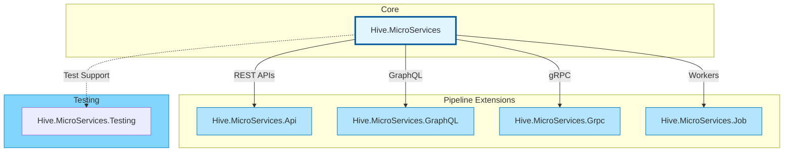
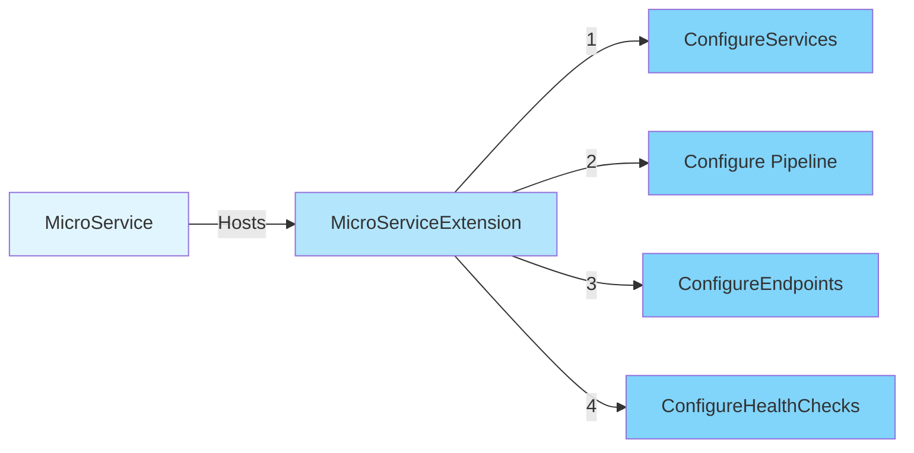
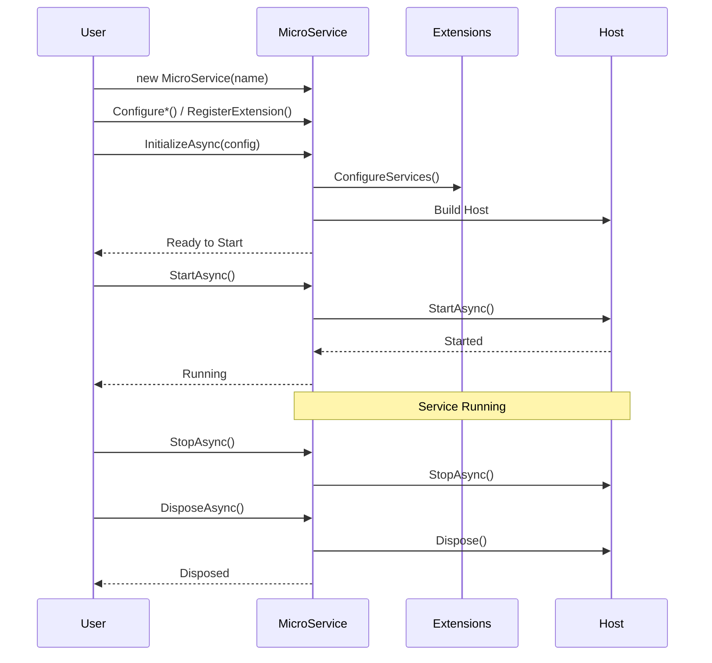
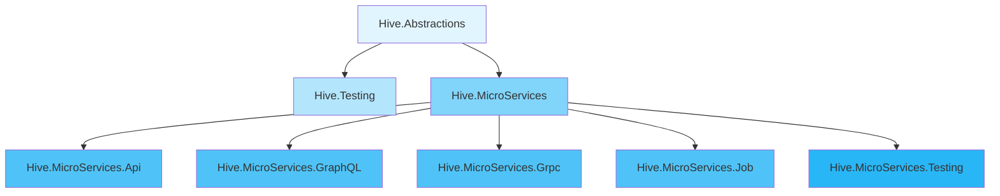

# Hive Microservices

An opinionated, extensible microservices framework built on ASP.NET Core for building production-ready services with minimal boilerplate.

## Overview

The Hive Microservices module provides a comprehensive framework for building microservices in .NET 10. It follows a plugin-based architecture where all features are implemented as extensions to the core `IMicroService` abstraction, enabling clean separation of concerns and maximum flexibility.

## Architecture



## Module Contents

### Core Framework

#### [Hive.MicroServices](src/Hive.MicroServices/)

The foundation of all Hive microservices. Provides:
- Core `MicroService` orchestration framework
- Extension pattern infrastructure
- Lifecycle management (Initialize → Start → Stop → Dispose)
- Configuration management (pre/post-configuration patterns)
- Kubernetes integration (startup, readiness, liveness probes)
- Resource disposal patterns (IAsyncDisposable, IDisposable)

**Key Features:**
- Pipeline mode abstraction
- Extension-based architecture
- Built-in health checks
- Comprehensive error handling
- ASP.NET Core host integration

📖 [Read Full Documentation](src/Hive.MicroServices/README.md)

### Pipeline Extensions

#### [Hive.MicroServices.Api](src/Hive.MicroServices.Api/)

REST API support with both minimal APIs and controller-based approaches.

**Capabilities:**
- Minimal API endpoint routing
- Traditional MVC controllers
- Automatic service registration
- API-specific middleware configuration

**Use Cases:** REST APIs, HTTP microservices, web services

---

#### [Hive.MicroServices.GraphQL](src/Hive.MicroServices.GraphQL/)

GraphQL API support powered by HotChocolate.

**Capabilities:**
- HotChocolate integration
- Schema-first development
- GraphQL-specific middleware
- Subscription support

**Use Cases:** GraphQL services, real-time data APIs, flexible query interfaces

---

#### [Hive.MicroServices.Grpc](src/Hive.MicroServices.Grpc/)

gRPC service support with standard protobuf-first approach.

**Capabilities:**
- Standard gRPC services
- Protobuf-first development
- Code-first gRPC (optional)
- Streaming support

**Use Cases:** High-performance RPC, inter-service communication, streaming services

---

#### [Hive.MicroServices.Job](src/Hive.MicroServices.Job/)

Background worker and scheduled job support.

**Capabilities:**
- Background service hosting
- Scheduled task execution
- Worker service patterns
- Long-running processes

**Use Cases:** Background workers, scheduled tasks, message processors, queue consumers

### Testing Support

#### [Hive.MicroServices.Testing](src/Hive.MicroServices.Testing/)

Integration testing utilities using ASP.NET Core TestServer.

**Capabilities:**
- `ConfigureTestHost()` extension for in-memory testing
- TestServer integration
- Full Hive configuration preservation
- Idempotent test setup

**Benefits:**
- Fast in-memory tests
- No HTTP server overhead
- Complete integration testing
- Simple test setup

📖 [Read Full Testing Guide](src/Hive.MicroServices.Testing/README.md)

## Quick Start

### Basic REST API

```csharp
using Hive;
using Hive.MicroServices.Api;

var microservice = new MicroService("my-api")
    .ConfigureApiPipeline(endpoints =>
    {
        endpoints.MapGet("/health", () => Results.Ok("Healthy"));
        endpoints.MapGet("/api/users", () => Results.Ok(new[] { "Alice", "Bob" }));
    });

await microservice.RunAsync();
```

### With Configuration and Services

```csharp
var config = new ConfigurationBuilder()
    .AddJsonFile("appsettings.json")
    .AddEnvironmentVariables()
    .Build();

var microservice = new MicroService("my-service")
    .ConfigureServices((services, configuration) =>
    {
        services.AddSingleton<IUserService, UserService>();
        services.ConfigureValidatedOptions<AppSettings>(
            configuration.GetSection("App")
        );
    })
    .ConfigureApiPipeline(endpoints =>
    {
        endpoints.MapGet("/api/users", async (IUserService userService) =>
        {
            var users = await userService.GetUsersAsync();
            return Results.Ok(users);
        });
    });

await microservice.RunAsync(config);
```

### Integration Testing

```csharp
using Hive.MicroServices.Api;
using Hive.MicroServices.Testing;
using Microsoft.AspNetCore.TestHost;
using Xunit;

public class ApiTests
{
    [Fact]
    public async Task GivenEndpoint_WhenCalled_ThenReturnsOk()
    {
        await using var microservice = new MicroService("test-service")
            .ConfigureApiPipeline(endpoints =>
            {
                endpoints.MapGet("/api/test", () => Results.Ok("Success"));
            })
            .ConfigureTestHost();

        await microservice.InitializeAsync(new ConfigurationBuilder().Build());
        await microservice.StartAsync();

        var server = ((MicroService)microservice).Host.GetTestServer();
        var client = server.CreateClient();
        var response = await client.GetAsync("/api/test");

        response.StatusCode.Should().Be(HttpStatusCode.OK);

        await microservice.StopAsync();
    }
}
```

## Pipeline Modes

Each extension configures a specific pipeline mode:

| Extension | Pipeline Mode | Description |
|-----------|--------------|-------------|
| **Api** | `Api` | Minimal APIs with endpoint routing |
| **Api** | `ApiControllers` | Traditional MVC controller-based APIs |
| **GraphQL** | `GraphQL` | GraphQL APIs via HotChocolate |
| **Grpc** | `Grpc` | gRPC services (protobuf-first) |
| **Job** | `Job` | Background worker services |
| - | `None` | Basic service without HTTP |

## Extension Pattern

All framework features follow a consistent extension pattern:



### Creating Custom Extensions

```csharp
public class MyCustomExtension : MicroServiceExtension
{
    public MyCustomExtension(IMicroService microService) : base(microService)
    {
    }

    public override void ConfigureServices(IServiceCollection services, IConfiguration configuration)
    {
        services.AddSingleton<IMyService, MyService>();
    }

    public override void Configure(IApplicationBuilder app)
    {
        app.UseMiddleware<MyCustomMiddleware>();
    }

    public override void ConfigureEndpoints(IEndpointRouteBuilder endpoints)
    {
        endpoints.MapGet("/custom", () => "Custom endpoint");
    }
}

// Usage
var microservice = new MicroService("my-service")
    .RegisterExtension<MyCustomExtension>()
    .ConfigureApiPipeline(endpoints => { /* ... */ });
```

## Lifecycle



## Kubernetes Integration

All Hive microservices include built-in Kubernetes probe endpoints:

```yaml
# Example Kubernetes configuration
apiVersion: v1
kind: Pod
metadata:
  name: my-microservice
spec:
  containers:
  - name: app
    image: my-microservice:latest
    ports:
    - containerPort: 8080
    startupProbe:
      httpGet:
        path: /startup
        port: 8080
      failureThreshold: 30
      periodSeconds: 10
    livenessProbe:
      httpGet:
        path: /liveness
        port: 8080
      periodSeconds: 10
    readinessProbe:
      httpGet:
        path: /readiness
        port: 8080
      periodSeconds: 5
```

## Demo Applications

See complete examples in the [demo/](demo/) folder:

- **[Hive.MicroServices.Demo.Api](demo/Hive.MicroServices.Demo.Api/)**: REST API demo
- **[Hive.MicroServices.Demo.Aspire](demo/Hive.MicroServices.Demo.Aspire/)**: Aspire orchestration with all demos

### Running Demos

```bash
# Run API demo
dotnet run --project demo/Hive.MicroServices.Demo.Api

# Run Aspire orchestration (all demos)
dotnet run --project demo/Hive.MicroServices.Demo.Aspire
```

## Project Structure

```
hive.microservices/
├── demo/                              # Demo applications
│   ├── Hive.MicroServices.Demo.Api/
│   ├── Hive.MicroServices.Demo.Aspire/
│   └── Hive.MicroServices.Demo.ServiceDefaults/
├── src/                               # Source code
│   ├── Hive.MicroServices/           # Core framework
│   ├── Hive.MicroServices.Api/       # REST API support
│   ├── Hive.MicroServices.GraphQL/   # GraphQL support
│   ├── Hive.MicroServices.Grpc/      # gRPC support
│   ├── Hive.MicroServices.Job/       # Background job support
│   └── Hive.MicroServices.Testing/   # Testing utilities
└── tests/                             # Test projects
    └── Hive.MicroServices.Tests/
```

## Dependencies

### Core Dependencies
- .NET 10.0
- ASP.NET Core
- Microsoft.Extensions.* (Hosting, DependencyInjection, Configuration)

### Optional Dependencies (via extensions)
- HotChocolate (GraphQL)
- Grpc.AspNetCore (gRPC)
- OpenTelemetry (Observability)

## Related Projects

### Within Hive Repository
- **[Hive.Abstractions](../hive.core/src/Hive.Abstractions/)**: Core abstractions and interfaces
- **[Hive.Testing](../hive.core/src/Hive.Testing/)**: Generic testing utilities
- **[Hive.OpenTelemetry](../hive.opentelemetry/)**: OpenTelemetry integration

### Dependency Graph



## Building and Testing

### Build All Projects

```bash
# Using CloudTek.Build.Tool (recommended)
dotnet tool run cloudtek-build --target All

# Using dotnet CLI
dotnet build Hive.sln
```

### Run Tests

```bash
# All tests
dotnet test Hive.sln

# Integration tests only
dotnet test --filter Category=IntegrationTests

# Unit tests only
dotnet test --filter Category=UnitTests
```

## Package Information

All packages are published to NuGet:

| Package | Description | Version |
|---------|-------------|---------|
| `Hive.MicroServices` | Core framework |  |
| `Hive.MicroServices.Api` | REST API support |  |
| `Hive.MicroServices.GraphQL` | GraphQL support |  |
| `Hive.MicroServices.Grpc` | gRPC support |  |
| `Hive.MicroServices.Job` | Background jobs |  |
| `Hive.MicroServices.Testing` | Testing utilities |  |

## Repository

- **GitHub**: https://github.com/cloud-tek/hive
- **License**: [Check repository]
- **Target Framework**: .NET 10.0

## Contributing

This is part of the Hive monorepo. For contribution guidelines, see the [main repository](https://github.com/cloud-tek/hive).
