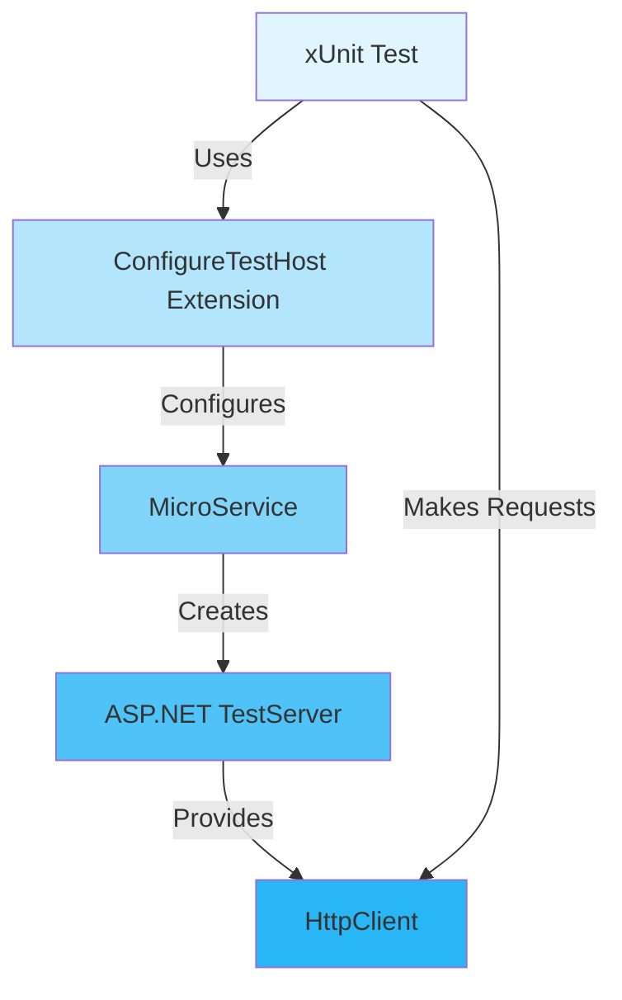
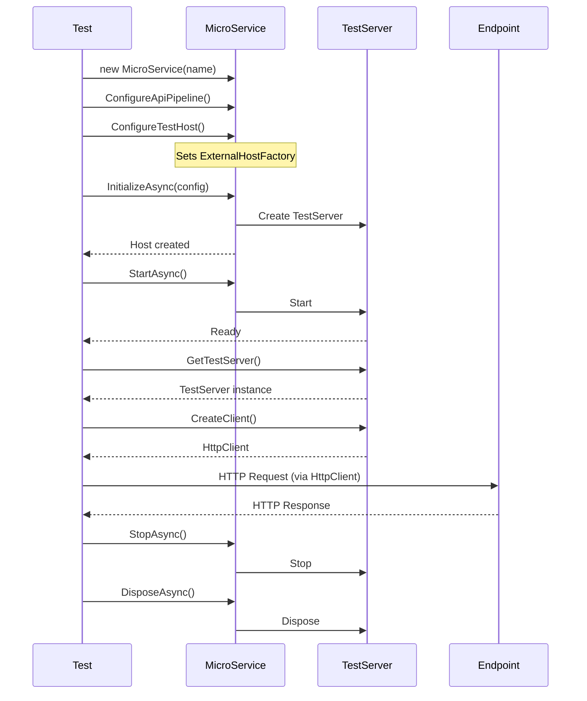
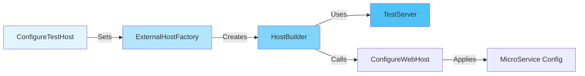

# Hive.MicroServices.Testing

Integration testing utilities for Hive microservices using ASP.NET Core TestServer.

## Overview

`Hive.MicroServices.Testing` provides testing extensions that enable integration testing of Hive microservices using the ASP.NET Core TestServer infrastructure. This allows you to test your microservices in-memory without needing to start actual HTTP servers.

## Architecture



## Installation

Add the package reference to your test project:

```xml
<ItemGroup>
  <PackageReference Include="Hive.MicroServices.Testing" />
</ItemGroup>
```

## Basic Usage

### Simple Integration Test

```csharp
using Hive.MicroServices.Api;
using Hive.MicroServices.Testing;
using Microsoft.AspNetCore.TestHost;
using Microsoft.Extensions.Configuration;
using Xunit;

public class MyApiTests
{
    [Fact]
    public async Task GivenEndpoint_WhenCalled_ThenReturnsOk()
    {
        // Arrange
        var config = new ConfigurationBuilder().Build();

        await using var microservice = new MicroService("test-service")
            .ConfigureApiPipeline(endpoints =>
            {
                endpoints.MapGet("/api/test", () => Results.Ok(new { message = "Hello" }));
            })
            .ConfigureTestHost();

        // Act
        await microservice.InitializeAsync(config);
        await microservice.StartAsync();

        var server = ((MicroService)microservice).Host.GetTestServer();
        var client = server.CreateClient();
        var response = await client.GetAsync("/api/test");

        // Assert
        response.StatusCode.Should().Be(HttpStatusCode.OK);
        var content = await response.Content.ReadAsStringAsync();
        content.Should().Contain("Hello");

        // Cleanup
        await microservice.StopAsync();
    }
}
```

## Testing Workflow



## ConfigureTestHost Extension

The `ConfigureTestHost()` extension method is the core of the testing framework.

### How It Works



### Key Features

- **Idempotent**: Safe to call multiple times (no side effects)
- **TestServer Integration**: Uses `Microsoft.AspNetCore.TestHost`
- **Full Configuration**: Preserves all Hive configuration and extensions
- **In-Memory**: No actual HTTP server required

## Testing with Configuration

```csharp
[Fact]
public async Task GivenConfiguration_WhenAccessingEndpoint_ThenConfigurationIsApplied()
{
    // Arrange
    var config = new ConfigurationBuilder()
        .AddInMemoryCollection(new Dictionary<string, string?>
        {
            ["AppName"] = "TestApp",
            ["Database:ConnectionString"] = "Server=test;Database=test"
        })
        .Build();

    await using var microservice = new MicroService("test-service")
        .ConfigureServices((services, cfg) =>
        {
            // Configuration available here
            var appName = cfg["AppName"];
            services.AddSingleton<IMyService>(new MyService(appName));
        })
        .ConfigureApiPipeline(endpoints =>
        {
            endpoints.MapGet("/api/config", (IConfiguration configuration) =>
                Results.Ok(new { appName = configuration["AppName"] }));
        })
        .ConfigureTestHost();

    // Act
    await microservice.InitializeAsync(config);
    await microservice.StartAsync();

    var server = ((MicroService)microservice).Host.GetTestServer();
    var client = server.CreateClient();
    var response = await client.GetAsync("/api/config");

    // Assert
    response.StatusCode.Should().Be(HttpStatusCode.OK);
    var content = await response.Content.ReadAsStringAsync();
    content.Should().Contain("TestApp");

    await microservice.StopAsync();
}
```

## Testing Multiple Endpoints

```csharp
[Fact]
public async Task GivenMultipleEndpoints_WhenMakingRequests_ThenAllRespond()
{
    // Arrange
    var config = new ConfigurationBuilder().Build();

    await using var microservice = new MicroService("test-service")
        .ConfigureApiPipeline(endpoints =>
        {
            endpoints.MapGet("/api/users", () => Results.Ok(new[] { "Alice", "Bob" }));
            endpoints.MapGet("/api/products", () => Results.Ok(new[] { "Product1", "Product2" }));
            endpoints.MapPost("/api/orders", () => Results.Created("/api/orders/1", new { id = 1 }));
        })
        .ConfigureTestHost();

    await microservice.InitializeAsync(config);
    await microservice.StartAsync();

    var server = ((MicroService)microservice).Host.GetTestServer();
    var client = server.CreateClient();

    // Act & Assert - GET /api/users
    var usersResponse = await client.GetAsync("/api/users");
    usersResponse.StatusCode.Should().Be(HttpStatusCode.OK);

    // Act & Assert - GET /api/products
    var productsResponse = await client.GetAsync("/api/products");
    productsResponse.StatusCode.Should().Be(HttpStatusCode.OK);

    // Act & Assert - POST /api/orders
    var ordersResponse = await client.PostAsync("/api/orders", null);
    ordersResponse.StatusCode.Should().Be(HttpStatusCode.Created);

    await microservice.StopAsync();
}
```

## Testing with Services

```csharp
public interface IUserService
{
    Task<User[]> GetUsersAsync();
}

public class UserServiceTests
{
    [Fact]
    public async Task GivenUserService_WhenCallingEndpoint_ThenReturnsUsers()
    {
        // Arrange
        var mockUserService = new Mock<IUserService>();
        mockUserService
            .Setup(x => x.GetUsersAsync())
            .ReturnsAsync(new[] { new User { Id = 1, Name = "Alice" } });

        var config = new ConfigurationBuilder().Build();

        await using var microservice = new MicroService("test-service")
            .ConfigureServices((services, _) =>
            {
                services.AddSingleton(mockUserService.Object);
            })
            .ConfigureApiPipeline(endpoints =>
            {
                endpoints.MapGet("/api/users", async (IUserService userService) =>
                {
                    var users = await userService.GetUsersAsync();
                    return Results.Ok(users);
                });
            })
            .ConfigureTestHost();

        await microservice.InitializeAsync(config);
        await microservice.StartAsync();

        // Act
        var server = ((MicroService)microservice).Host.GetTestServer();
        var client = server.CreateClient();
        var response = await client.GetAsync("/api/users");

        // Assert
        response.StatusCode.Should().Be(HttpStatusCode.OK);
        var content = await response.Content.ReadAsStringAsync();
        content.Should().Contain("Alice");

        mockUserService.Verify(x => x.GetUsersAsync(), Times.Once);

        await microservice.StopAsync();
    }
}
```

## Testing with Extensions

```csharp
[Fact]
public async Task GivenExtension_WhenStarted_ThenExtensionIsActive()
{
    // Arrange
    var config = new ConfigurationBuilder().Build();

    await using var microservice = new MicroService("test-service")
        .WithOpenTelemetry(
            logging: builder => { /* test logging config */ },
            tracing: builder => { /* test tracing config */ }
        )
        .ConfigureApiPipeline(endpoints =>
        {
            endpoints.MapGet("/", () => "Hello");
        })
        .ConfigureTestHost();

    // Act
    await microservice.InitializeAsync(config);
    await microservice.StartAsync();

    // Assert
    microservice.Extensions.Should().Contain(e => e is OpenTelemetryExtension);

    var server = ((MicroService)microservice).Host.GetTestServer();
    var client = server.CreateClient();
    var response = await client.GetAsync("/");
    response.StatusCode.Should().Be(HttpStatusCode.OK);

    await microservice.StopAsync();
}
```

## Best Practices

### 1. Use Async Disposal

Always use `await using` to ensure proper cleanup:

```csharp
await using var microservice = new MicroService("test-service")
    .ConfigureTestHost();
// Automatically disposed
```

### 2. Always Call StopAsync

Before disposal, explicitly stop the service:

```csharp
await microservice.StartAsync();
// ... tests ...
await microservice.StopAsync(); // Clean shutdown
```

### 3. Use Configuration Builders

Build configuration explicitly for tests:

```csharp
var config = new ConfigurationBuilder()
    .AddInMemoryCollection(new Dictionary<string, string?>
    {
        ["Setting"] = "Value"
    })
    .Build();
```

### 4. Test Categories

Use Hive's test attributes for categorization:

```csharp
using Hive.Testing;

[Fact]
[IntegrationTest] // Category: "IntegrationTests"
public async Task MyIntegrationTest()
{
    // ...
}
```

### 5. Idempotency

`ConfigureTestHost()` is idempotent - calling it multiple times has no side effects:

```csharp
var microservice = new MicroService("test")
    .ConfigureTestHost()
    .ConfigureTestHost(); // Safe, no duplicate configuration
```

## Advanced Scenarios

### Custom HttpClient Configuration

```csharp
var server = ((MicroService)microservice).Host.GetTestServer();
var client = server.CreateClient();

// Configure client
client.BaseAddress = new Uri("https://localhost");
client.DefaultRequestHeaders.Authorization =
    new AuthenticationHeaderValue("Bearer", "test-token");
```

### Testing Error Handling

```csharp
[Fact]
public async Task GivenInvalidRequest_WhenCalled_ThenReturns400()
{
    await using var microservice = new MicroService("test-service")
        .ConfigureApiPipeline(endpoints =>
        {
            endpoints.MapPost("/api/validate", (MyRequest request) =>
            {
                if (string.IsNullOrEmpty(request.Name))
                    return Results.BadRequest("Name is required");
                return Results.Ok();
            });
        })
        .ConfigureTestHost();

    await microservice.InitializeAsync(new ConfigurationBuilder().Build());
    await microservice.StartAsync();

    var server = ((MicroService)microservice).Host.GetTestServer();
    var client = server.CreateClient();

    var response = await client.PostAsJsonAsync("/api/validate", new { });

    response.StatusCode.Should().Be(HttpStatusCode.BadRequest);

    await microservice.StopAsync();
}
```

## Comparison with Other Testing Approaches

```mermaid
graph TB
    subgraph "Hive.MicroServices.Testing"
        HiveTest[Test Code]
        HiveTestServer[TestServer]
        HiveInMemory[In-Memory]

        HiveTest -->|Uses| HiveTestServer
        HiveTestServer -->|Runs| HiveInMemory
    end

    subgraph "WebApplicationFactory"
        WAFTest[Test Code]
        WAFFactory[WebApplicationFactory]
        WAFTestServer[TestServer]

        WAFTest -->|Uses| WAFFactory
        WAFFactory -->|Creates| WAFTestServer
    end

    subgraph "Manual HTTP Server"
        ManualTest[Test Code]
        ManualServer[Kestrel Server]
        ManualHttp[HTTP Calls]

        ManualTest -->|Calls| ManualHttp
        ManualHttp -->|Hits| ManualServer
    end

    style HiveInMemory fill:#4caf50
    style WAFTestServer fill:#81d4fa
    style ManualServer fill:#ff9800
```



| Approach | Speed | Setup Complexity | Isolation | Hive Integration |
|----------|-------|------------------|-----------|------------------|
| **Hive.MicroServices.Testing** | ⚡⚡⚡ Fast | ✅ Simple | ✅ Full | ✅ Native |
| **WebApplicationFactory** | ⚡⚡ Fast | ⚠️ Moderate | ✅ Full | ⚠️ Manual |
| **Manual HTTP Server** | ⚡ Slow | ❌ Complex | ❌ Partial | ⚠️ Manual |

## Related Libraries

- **[Hive.MicroServices](../Hive.MicroServices/)**: Core microservices framework
- **[Hive.Testing](../../../hive.core/src/Hive.Testing/)**: Generic testing utilities
- **[Microsoft.AspNetCore.TestHost](https://www.nuget.org/packages/Microsoft.AspNetCore.Mvc.Testing/)**: ASP.NET Core test infrastructure

## Package Information

- **Package**: `Hive.MicroServices.Testing`
- **Target Framework**: .NET 10.0
- **Repository**: https://github.com/cloud-tek/hive

## Example Test Project

See the complete examples in:
- [Hive.MicroServices.Tests](../../tests/Hive.MicroServices.Tests/)
- [MicroServiceTests.WebApplicationFactory.cs](../../tests/Hive.MicroServices.Tests/MicroServiceTests.WebApplicationFactory.cs)
