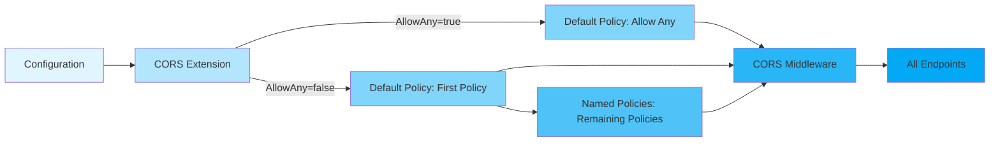
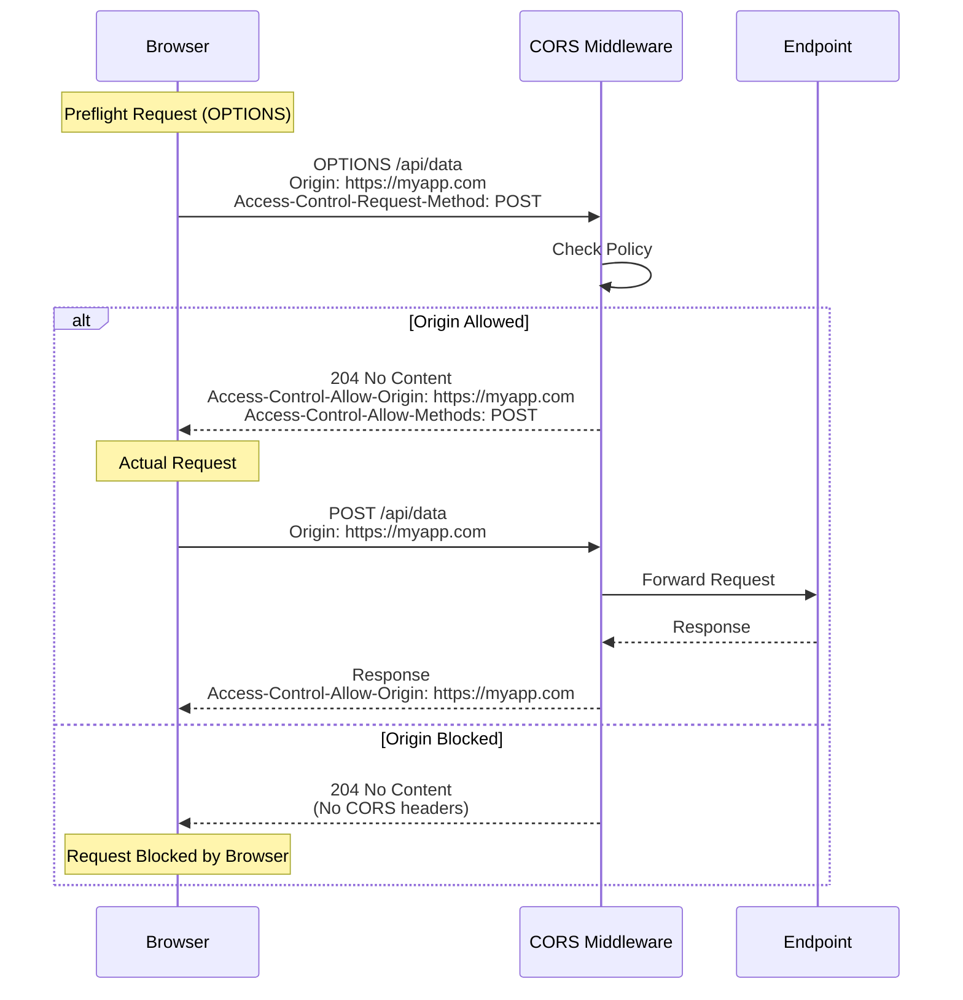

# CORS Extension

The CORS extension provides Cross-Origin Resource Sharing (CORS) configuration for Hive microservices, enabling secure cross-origin HTTP requests from web browsers.

## Overview

CORS is a security mechanism that allows web applications running on one domain to access resources from another domain. This extension configures CORS policies that control which origins, HTTP methods, and headers are permitted in cross-origin requests.

## Quick Start

### Allow Any Origin (Development)

```csharp
var microservice = new MicroService("my-api")
    .WithCORS()  // Registers CORS extension with default "AllowAny" configuration
    .ConfigureApiPipeline(endpoints =>
    {
        endpoints.MapGet("/api/data", () => Results.Ok(new { data = "value" }));
    });

await microservice.RunAsync(config);
```

**Configuration (appsettings.json):**
```json
{
  "Hive": {
    "CORS": {
      "AllowAny": true
    }
  }
}
```

### Restrictive Policies (Production)

```csharp
var microservice = new MicroService("my-api")
    .WithCORS()
    .ConfigureApiPipeline(endpoints =>
    {
        endpoints.MapGet("/api/data", () => Results.Ok(new { data = "value" }));
    });

await microservice.RunAsync(config);
```

**Configuration (appsettings.json):**
```json
{
  "Hive": {
    "CORS": {
      "AllowAny": false,
      "Policies": [
        {
          "Name": "WebApp",
          "AllowedOrigins": ["https://myapp.com", "https://www.myapp.com"],
          "AllowedMethods": ["GET", "POST", "PUT", "DELETE"],
          "AllowedHeaders": ["Content-Type", "Authorization"]
        }
      ]
    }
  }
}
```

## Configuration

### AllowAny Mode

Use this mode in **development only**. It allows requests from any origin.

```json
{
  "Hive": {
    "CORS": {
      "AllowAny": true
    }
  }
}
```

**Generated Policy:**
- **Origins:** `*` (any origin)
- **Methods:** All HTTP methods
- **Headers:** All headers
- **Credentials:** Not allowed (incompatible with wildcard origin)

### Policy-Based Mode

Use this mode in **production**. Define one or more named policies with specific restrictions.

```json
{
  "Hive": {
    "CORS": {
      "AllowAny": false,
      "Policies": [
        {
          "Name": "WebApp",
          "AllowedOrigins": ["https://myapp.com"],
          "AllowedMethods": ["GET", "POST"],
          "AllowedHeaders": ["Content-Type", "Authorization"]
        },
        {
          "Name": "MobileApp",
          "AllowedOrigins": ["capacitor://localhost", "ionic://localhost"],
          "AllowedMethods": ["GET", "POST", "PUT", "DELETE"],
          "AllowedHeaders": ["Content-Type", "Authorization", "X-Device-Id"]
        }
      ]
    }
  }
}
```

### Configuration Schema

```typescript
{
  "Hive": {
    "CORS": {
      // Enable "allow any origin" mode (development only)
      "AllowAny": boolean,

      // Named policies (production)
      "Policies": [
        {
          // Policy name (must be unique)
          "Name": string,

          // Allowed origins (e.g., "https://example.com")
          "AllowedOrigins": string[],

          // Allowed HTTP methods (e.g., "GET", "POST")
          "AllowedMethods": string[],

          // Allowed request headers
          "AllowedHeaders": string[]
        }
      ]
    }
  }
}
```

## How It Works

### Default Policy Pattern

The CORS extension uses ASP.NET Core's **default policy pattern**, which means:

1. **First Policy as Default:** When `AllowAny = false`, the first policy in the `Policies` array becomes the default policy applied to all endpoints automatically.

2. **Additional Named Policies:** Subsequent policies are registered as named policies that can be applied selectively to specific endpoints (advanced scenarios).

3. **Automatic Application:** The default policy applies to all HTTP endpoints without requiring `[EnableCors]` attributes or per-endpoint configuration.

### Policy Registration



### Request Flow



## Validation

The CORS extension validates configuration at startup using FluentValidation:

### Validation Rules

1. **AllowAny Mode:**
   - No additional validation required

2. **Policy Mode:**
   - At least one policy must be defined
   - Each policy must have a unique name
   - `AllowedOrigins` must not be empty
   - `AllowedMethods` must not be empty
   - `AllowedHeaders` can be empty (no header restrictions)
   - Origins must be valid URIs or wildcards
   - Methods must be valid HTTP methods

### Validation Errors

If validation fails, the microservice will **fail to start** with a detailed error message:

```
Hive:CORS validation failed
- Policies collection cannot be empty when AllowAny is false
- Policy 'WebApp': AllowedOrigins must contain at least one origin
```

## Advanced Usage

### Multiple Policies

Define multiple policies for different client types:

```json
{
  "Hive": {
    "CORS": {
      "AllowAny": false,
      "Policies": [
        {
          "Name": "DefaultPolicy",
          "AllowedOrigins": ["https://myapp.com"],
          "AllowedMethods": ["GET", "POST"],
          "AllowedHeaders": ["Content-Type"]
        },
        {
          "Name": "AdminPortal",
          "AllowedOrigins": ["https://admin.myapp.com"],
          "AllowedMethods": ["GET", "POST", "PUT", "DELETE"],
          "AllowedHeaders": ["Content-Type", "Authorization"]
        },
        {
          "Name": "PublicAPI",
          "AllowedOrigins": ["*"],
          "AllowedMethods": ["GET"],
          "AllowedHeaders": ["Content-Type"]
        }
      ]
    }
  }
}
```

**Note:** The first policy (`DefaultPolicy`) applies to all endpoints by default. Additional policies can be applied per-endpoint using the `[EnableCors("PolicyName")]` attribute (advanced scenario).

### Environment-Specific Configuration

```json
// appsettings.Development.json
{
  "Hive": {
    "CORS": {
      "AllowAny": true
    }
  }
}

// appsettings.Production.json
{
  "Hive": {
    "CORS": {
      "AllowAny": false,
      "Policies": [
        {
          "Name": "Production",
          "AllowedOrigins": ["https://myapp.com"],
          "AllowedMethods": ["GET", "POST"],
          "AllowedHeaders": ["Content-Type", "Authorization"]
        }
      ]
    }
  }
}
```

### Accessing Policy Name

The active policy name is exposed via the `PolicyName` property:

```csharp
var microservice = new MicroService("my-api")
    .WithCORS();

// After initialization
var corsExtension = microservice.Extensions
    .SingleOrDefault(x => x.Is<CORS.Extension>()) as CORS.Extension;

Console.WriteLine($"Active CORS Policy: {corsExtension?.PolicyName}");
// Output: "Active CORS Policy: DefaultPolicy (default)"
```

## Security Considerations

### ⚠️ Never Use AllowAny in Production

```json
// ❌ DANGEROUS - Allows any website to access your API
{
  "Hive": {
    "CORS": {
      "AllowAny": true
    }
  }
}
```

This configuration allows **any website** to make requests to your API, potentially exposing sensitive data or enabling CSRF attacks.

### ✅ Use Specific Origins in Production

```json
// ✅ SECURE - Only trusted origins can access your API
{
  "Hive": {
    "CORS": {
      "AllowAny": false,
      "Policies": [
        {
          "Name": "Production",
          "AllowedOrigins": [
            "https://myapp.com",
            "https://www.myapp.com"
          ],
          "AllowedMethods": ["GET", "POST"],
          "AllowedHeaders": ["Content-Type", "Authorization"]
        }
      ]
    }
  }
}
```

### Credentials and Wildcards

**You cannot use `AllowCredentials()` with wildcard origins.** The CORS specification forbids this combination for security reasons.

```csharp
// ❌ This would cause a runtime exception:
// policy.AllowCredentials();
// policy.AllowAnyOrigin();

// ✅ Correct approach for credentialed requests:
{
  "AllowedOrigins": ["https://myapp.com"],  // Specific origin
  "AllowedMethods": ["GET", "POST"],
  "AllowedHeaders": ["Content-Type", "Authorization"]
}
```

The framework **automatically prevents** this misconfiguration by not calling `AllowCredentials()` when using `AllowAnyOrigin()`.

## Common CORS Errors

### Browser Error: "No 'Access-Control-Allow-Origin' header"

**Cause:** The CORS middleware is not configured or the origin is not in the allowed list.

**Solution:**
1. Verify CORS extension is registered: `.WithCORS()`
2. Check configuration section exists: `"Hive:CORS"`
3. Ensure origin matches exactly (including protocol and port)
4. Check logs for validation errors at startup

### Browser Error: "Preflight request failed"

**Cause:** The preflight OPTIONS request was rejected.

**Solution:**
1. Ensure `AllowedMethods` includes the requested method
2. Ensure `AllowedHeaders` includes requested headers
3. Check for typos in origin URLs

### CORS Headers Present But Request Still Blocked

**Cause:** Origin mismatch (case-sensitive, includes port).

**Solution:**
```json
// ❌ Won't work if browser sends https://myapp.com:443
"AllowedOrigins": ["https://myapp.com"]

// ✅ Include explicit port or ensure exact match
"AllowedOrigins": ["https://myapp.com", "https://myapp.com:443"]
```

## Testing

### Unit Tests

Test CORS configuration validation:

```csharp
[Fact]
[UnitTest]
public void GivenInvalidConfiguration_WhenValidating_ThenThrows()
{
    var options = new CORS.Options
    {
        AllowAny = false,
        Policies = Array.Empty<CORSPolicy>()  // Empty!
    };

    var validator = new OptionsValidator(microservice);
    var result = validator.Validate(options);

    result.IsValid.Should().BeFalse();
}
```

### Integration Tests

Test actual CORS headers in HTTP responses:

```csharp
[Fact]
[IntegrationTest]
public async Task GivenAllowAnyPolicy_WhenRequestFromOrigin_ThenReturnsCorsHeaders()
{
    // Arrange
    var config = new ConfigurationBuilder()
        .AddInMemoryCollection(new Dictionary<string, string>
        {
            ["Hive:CORS:AllowAny"] = "true"
        })
        .Build();

    await using var microservice = new MicroService("test-service")
        .WithCORS()
        .ConfigureApiPipeline(endpoints =>
        {
            endpoints.MapGet("/api/test", () => Results.Ok("Success"));
        })
        .ConfigureTestHost();

    await microservice.InitializeAsync(config);
    await microservice.StartAsync();

    var server = ((MicroService)microservice).Host.GetTestServer();
    var client = server.CreateClient();

    // Act
    var request = new HttpRequestMessage(HttpMethod.Get, "/api/test");
    request.Headers.Add("Origin", "https://example.com");
    var response = await client.SendAsync(request);

    // Assert
    response.Headers.Should().Contain(h => h.Key == "Access-Control-Allow-Origin");
    response.Headers.GetValues("Access-Control-Allow-Origin")
        .Should().Contain("*");

    await microservice.StopAsync();
}
```

See [MicroServiceTests.CORS.Integration.cs](../../../tests/Hive.MicroServices.Tests/MicroServiceTests.CORS.Integration.cs) for comprehensive integration test examples.

## Pipeline Support

CORS middleware is automatically integrated into all HTTP pipeline modes:

| Pipeline Mode | CORS Support | Notes |
|--------------|--------------|-------|
| `Api` | ✅ Yes | Applied to all minimal API endpoints |
| `ApiControllers` | ✅ Yes | Applied to all controller actions |
| `GraphQL` | ✅ Yes | Applied to GraphQL endpoint |
| `Grpc` | ✅ Yes | Applied for gRPC-Web support |
| `Job` | ✅ Yes | Applied if health endpoints are exposed |
| `None` | ⚠️ Partial | Only if custom endpoints are registered |

## Architecture

### Extension Structure

```
CORS/
├── Extension.cs              # Main CORS extension
├── Options.cs                # Configuration model
├── OptionsValidator.cs       # FluentValidation validator
├── CORSPolicy.cs            # Individual policy model
├── CORSPolicyValidator.cs   # Policy-level validator
└── README.md                # This file
```

### Middleware Order

CORS middleware must be placed **after routing** but **before authorization** in the pipeline:

```
UseRouting()
  ↓
UseCors()       ← CORS middleware here
  ↓
UseAuthorization()
  ↓
UseEndpoints()
```

This order is automatically configured by the framework.

## Related Documentation

- [ASP.NET Core CORS Documentation](https://learn.microsoft.com/en-us/aspnet/core/security/cors)
- [CORS Specification (W3C)](https://www.w3.org/TR/cors/)
- [Hive MicroServices Framework](../README.md)
- [Configuration Patterns](../../../hive.core/src/Hive.Abstractions/README.md)

## Troubleshooting

### Enable CORS Logging

Add logging to see CORS decisions:

```json
{
  "Logging": {
    "LogLevel": {
      "Microsoft.AspNetCore.Cors": "Debug"
    }
  }
}
```

### Check Extension Registration

Verify the CORS extension is registered:

```csharp
var corsExtension = microservice.Extensions
    .SingleOrDefault(x => x.Is<CORS.Extension>());

if (corsExtension == null)
{
    Console.WriteLine("CORS extension not registered!");
}
```

### Verify Configuration Loading

Add logging to see loaded configuration:

```csharp
var corsConfig = configuration.GetSection("Hive:CORS");
Console.WriteLine($"AllowAny: {corsConfig["AllowAny"]}");
Console.WriteLine($"Policies Count: {corsConfig.GetSection("Policies").GetChildren().Count()}");
```

## Version History

- **10.0.0**: Fixed critical bugs (AllowCredentials+AllowAnyOrigin, default policy pattern, duplicate registration). Added comprehensive integration tests.
- **Earlier**: Initial implementation

## License

Part of the Hive framework. See repository root for license information.
