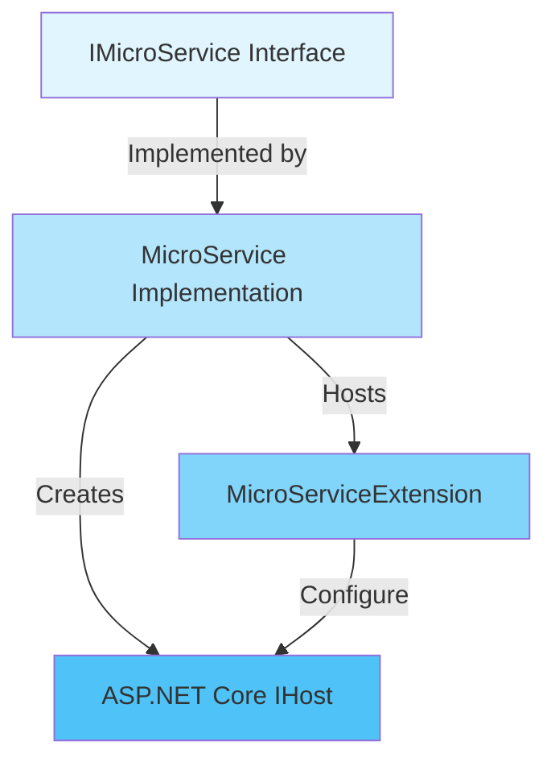
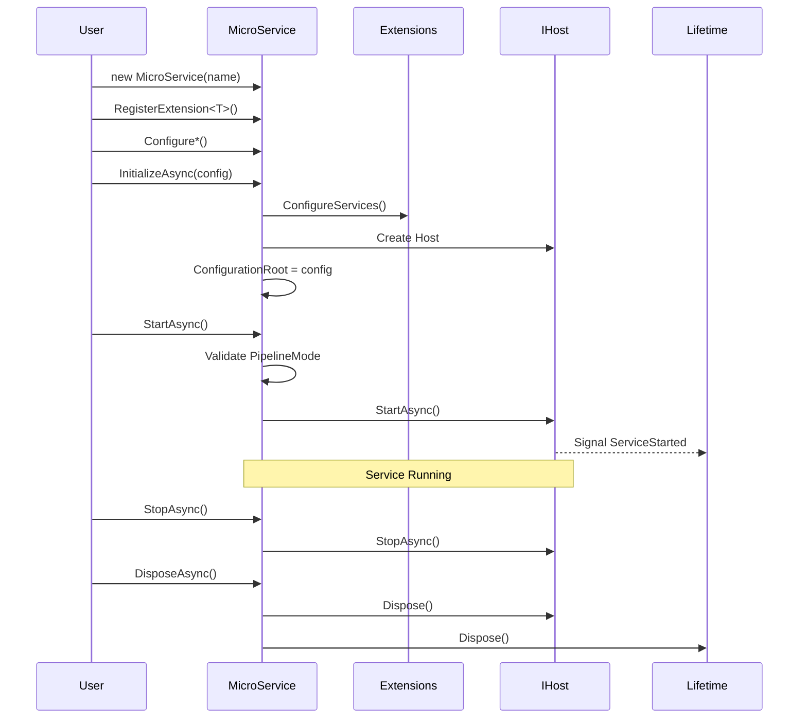
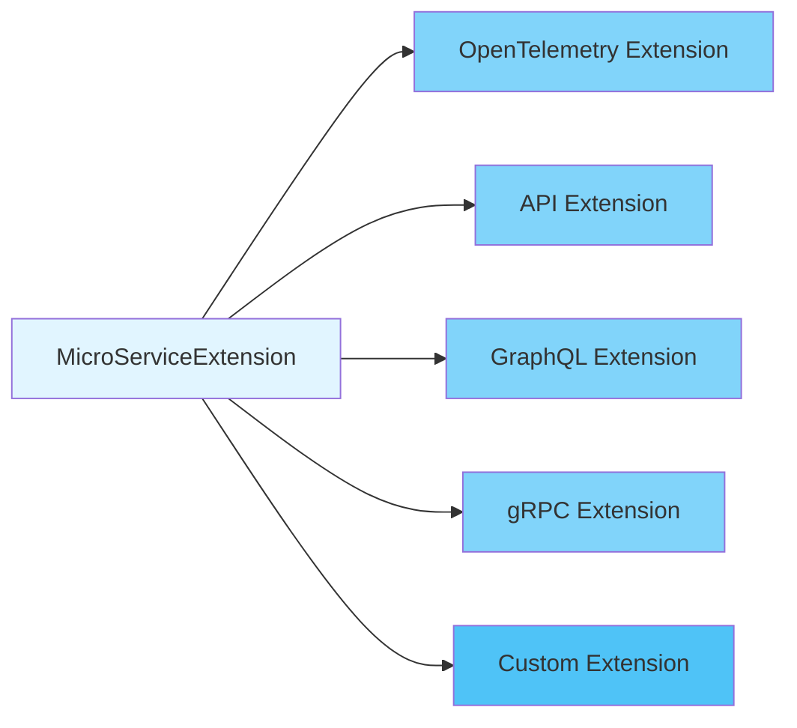
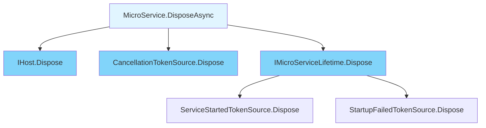

# Hive.MicroServices

Core microservices framework for building ASP.NET Core applications with the Hive platform.

## Overview

`Hive.MicroServices` provides an opinionated, extensible framework for building microservices on ASP.NET Core. It follows a plugin-based architecture where all features are implemented as extensions to the core `IMicroService` abstraction.

## Architecture

### Core Components



### Key Interfaces

- **`IMicroService`**: Core abstraction representing a microservice instance
- **`MicroServiceExtension`**: Base class for all framework extensions
- **`IMicroServiceLifetime`**: Lifecycle event management (startup, failure)

## Lifecycle



## Pipeline Modes

The framework supports multiple service types through pipeline modes:

| Mode | Description | Use Case |
|------|-------------|----------|
| `Api` | Minimal APIs with endpoint routing | Modern REST APIs |
| `ApiControllers` | Traditional controller-based APIs | Legacy-compatible APIs |
| `GraphQL` | GraphQL APIs via HotChocolate | GraphQL services |
| `Grpc` | gRPC services (protobuf-first) | High-performance RPC |
| `Job` | Background worker services | Scheduled tasks, workers |
| `None` | Basic service without HTTP | Console apps, utilities |

## Basic Usage

### Creating a Microservice

```csharp
using Hive;
using Hive.MicroServices.Api;

var microservice = new MicroService("my-service")
    .ConfigureApiPipeline(endpoints =>
    {
        endpoints.MapGet("/health", () => Results.Ok("Healthy"));
        endpoints.MapGet("/api/users", () => Results.Ok(new[] { "Alice", "Bob" }));
    });

await microservice.RunAsync();
```

### With Configuration

```csharp
var config = new ConfigurationBuilder()
    .AddJsonFile("appsettings.json")
    .AddEnvironmentVariables()
    .Build();

var microservice = new MicroService("my-service")
    .ConfigureServices((services, configuration) =>
    {
        services.AddSingleton<IMyService, MyService>();
    })
    .ConfigureApiPipeline(endpoints =>
    {
        endpoints.MapGet("/api/data", (IMyService service) =>
            Results.Ok(service.GetData()));
    });

await microservice.RunAsync(config);
```

### With Extensions

```csharp
var microservice = new MicroService("my-service")
    .WithOpenTelemetry(
        logging: builder => { /* configure logging */ },
        tracing: builder => { /* configure tracing */ }
    )
    .RegisterExtension<MyCustomExtension>()
    .ConfigureApiPipeline(endpoints =>
    {
        endpoints.MapGet("/", () => "Hello World");
    });

await microservice.RunAsync();
```

## Extension Pattern

All framework features are implemented as extensions inheriting from `MicroServiceExtension`.



### Creating a Custom Extension

```csharp
public class MyCustomExtension : MicroServiceExtension
{
    public MyCustomExtension(IMicroService microService) : base(microService)
    {
    }

    public override void ConfigureServices(IServiceCollection services, IConfiguration configuration)
    {
        services.AddSingleton<IMyCustomService, MyCustomService>();
    }

    public override void Configure(IApplicationBuilder app)
    {
        app.UseMiddleware<MyCustomMiddleware>();
    }
}
```

## Configuration Patterns

The framework provides two-phase configuration for different scenarios:

### Pre-configuration

Use when configuration is needed **before** `IServiceProvider` is built:

```csharp
services.PreConfigureValidatedOptions<MyOptions>(
    configuration.GetSection("MySection")
);
```

### Post-configuration

Standard options pattern **after** service provider is available:

```csharp
services.ConfigureValidatedOptions<MyOptions>(
    configuration.GetSection("MySection")
);
```

Both support validation via:
- DataAnnotations
- FluentValidation
- Custom delegates

## Kubernetes Integration

Built-in middleware provides probe endpoints for Kubernetes:

```mermaid
graph LR
    K8s[Kubernetes]
    Startup[/startup Probe]
    Readiness[/readiness Probe]
    Liveness[/liveness Probe]
    MicroService[MicroService]

    K8s -->|Checks| Startup
    K8s -->|Checks| Readiness
    K8s -->|Checks| Liveness

    Startup -->|IsStarted| MicroService
    Readiness -->|IsReady| MicroService
    Liveness -->|IsAlive| MicroService

    style K8s fill:#326ce5
    style Startup fill:#81d4fa
    style Readiness fill:#81d4fa
    style Liveness fill:#81d4fa
    style MicroService fill:#b3e5fc
```

### Probe Endpoints

- **`/startup`**: Returns 200 when `IMicroService.IsStarted == true`
- **`/readiness`**: Returns 200 when `IMicroService.IsReady == true`
- **`/liveness`**: Returns 200 when service is alive

## Initialization Modes

### RunAsync (Blocking)

Initializes, starts, and blocks until the service stops:

```csharp
var exitCode = await microservice.RunAsync(config);
// Execution blocks here until service stops
return exitCode;
```

### InitializeAsync + StartAsync (Non-blocking)

For scenarios requiring manual control:

```csharp
await microservice.InitializeAsync(config);
await microservice.StartAsync();

// Service is running, execution continues
// Do other work...

await microservice.StopAsync();
```

## Disposal

The framework implements proper disposal patterns for resource management:

```csharp
// Async disposal (preferred)
await using var microservice = new MicroService("my-service")
    .ConfigureApiPipeline(/* ... */);

await microservice.InitializeAsync(config);
await microservice.StartAsync();
// Automatically disposed at end of scope

// Synchronous disposal (fallback)
using var microservice = new MicroService("my-service");
// ...
```

### What Gets Disposed



## Error Handling

```csharp
try
{
    await microservice.StartAsync();
}
catch (ConfigurationException ex)
{
    // Pipeline mode not set or validation failed
    logger.LogError(ex, "Configuration error");
    throw;
}
catch (Exception ex)
{
    // Startup failed
    logger.LogError(ex, "Startup failed");
    throw;
}
```

### Startup Failure Detection

```csharp
// Using lifetime events
microservice.Lifetime.StartupFailed.Register(() =>
{
    logger.LogError("Service failed to start");
});

await microservice.StartAsync();
```

## Advanced Scenarios

### Custom Assembly Provider

For testing scenarios where entry assembly needs to be controlled:

```csharp
var microservice = new MicroService("test-service");
((MicroService)microservice).MicroServiceEntrypointAssemblyProvider =
    () => typeof(MyTestClass).Assembly;
```

### Accessing Service Provider

```csharp
await microservice.InitializeAsync(config);

// Access services after initialization
var myService = microservice.ServiceProvider.GetRequiredService<IMyService>();
```

## Related Libraries

- **[Hive.Abstractions](../../hive.core/src/Hive.Abstractions/)**: Core abstractions and interfaces
- **[Hive.MicroServices.Api](../Hive.MicroServices.Api/)**: REST API extensions (Minimal APIs, Controllers)
- **[Hive.MicroServices.GraphQL](../Hive.MicroServices.GraphQL/)**: GraphQL support
- **[Hive.MicroServices.Grpc](../Hive.MicroServices.Grpc/)**: gRPC support
- **[Hive.MicroServices.Job](../Hive.MicroServices.Job/)**: Background job support
- **[Hive.MicroServices.Testing](../Hive.MicroServices.Testing/)**: Testing utilities
- **[Hive.OpenTelemetry](../../hive.opentelemetry/)**: OpenTelemetry integration

## Built-in Extensions

- **[CORS Extension](CORS/README.md)**: Cross-Origin Resource Sharing support with validation

## Package Information

- **Package**: `Hive.MicroServices`
- **Target Framework**: .NET 10.0
- **Repository**: https://github.com/cloud-tek/hive
