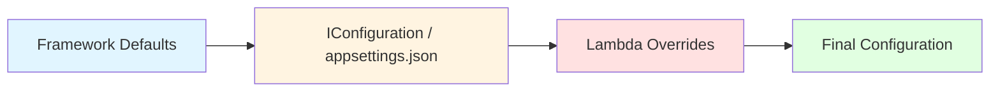
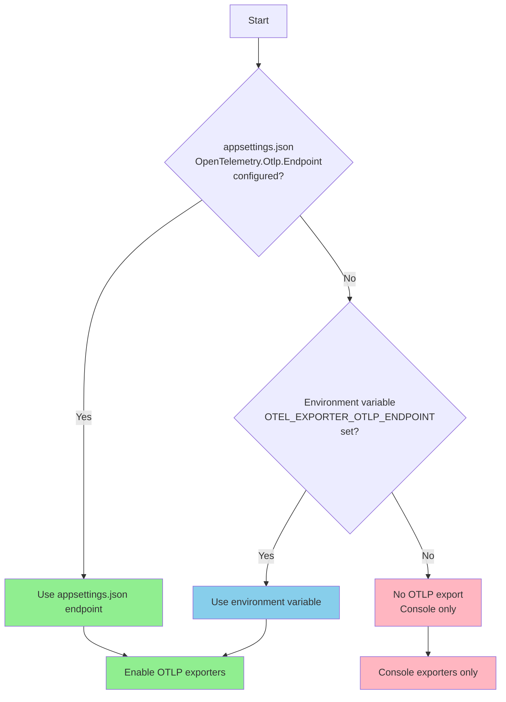
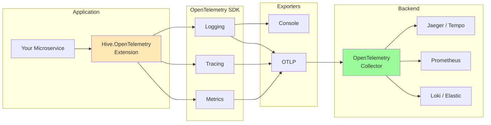
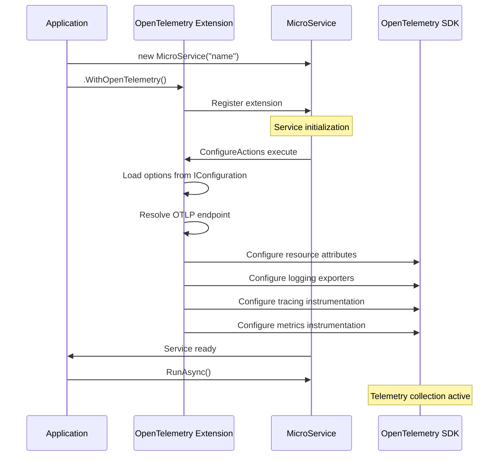

# Hive.OpenTelemetry

OpenTelemetry extension for Hive microservices providing unified observability through logs, traces, and metrics.

## Table of Contents

- [Overview](#overview)
- [Quick Start](#quick-start)
- [Configuration](#configuration)
- [Architecture](#architecture)
- [Usage Examples](#usage-examples)
- [Advanced Scenarios](#advanced-scenarios)
- [Testing](#testing)
- [Troubleshooting](#troubleshooting)

---

## Overview

The Hive.OpenTelemetry extension provides production-ready observability for Hive microservices using the OpenTelemetry standard. It supports:

- **Logging** - Structured logs via OpenTelemetry Logging API
- **Tracing** - Distributed tracing with automatic instrumentation
- **Metrics** - Runtime and application metrics collection
- **OTLP Export** - Send telemetry to OpenTelemetry collectors

### Key Features

✅ **Zero Configuration** - Works out of the box with sensible defaults
✅ **Declarative Configuration** - Configure via `appsettings.json`
✅ **Environment-Aware** - Different configs per environment (dev/staging/prod)
✅ **OTEL Standard Compliant** - Respects standard environment variables
✅ **Programmatic Overrides** - Lambda callbacks for advanced scenarios
✅ **Automatic Instrumentation** - ASP.NET Core, HTTP Client, Runtime metrics

---

## Quick Start

### Installation

```bash
# The package is part of the Hive monorepo
# Reference it in your project:
```

```xml
<ItemGroup>
  <ProjectReference Include="path/to/hive.opentelemetry/src/Hive.OpenTelemetry/Hive.OpenTelemetry.csproj" />
</ItemGroup>
```

### Basic Usage

```csharp
using Hive.MicroServices;
using Hive.MicroServices.Api;
using Hive.OpenTelemetry;

var service = new MicroService("my-service")
    .WithOpenTelemetry()  // That's it! Uses defaults
    .ConfigureApiPipeline(app =>
    {
        app.MapGet("/hello", () => "Hello World!");
    });

await service.RunAsync();
```

**What you get:**
- ✓ Console exporter for logs
- ✓ ASP.NET Core + HTTP Client tracing
- ✓ ASP.NET Core + HTTP Client + Runtime metrics
- ✓ Resource attributes with service name and instance ID

---

## Configuration

### Configuration Hierarchy

The extension uses a three-layer configuration system:



**Priority Order:**
1. **Lambda Overrides** (highest) - Programmatic configuration via callbacks
2. **IConfiguration** (medium) - Configuration from `appsettings.json`, environment variables, command line
3. **Framework Defaults** (lowest) - Built-in sensible defaults

### Configuration Schema

Add to your `appsettings.json`:

```json
{
  "OpenTelemetry": {
    "Resource": {
      "ServiceNamespace": "my-company.services",
      "ServiceVersion": "1.0.0",
      "Attributes": {
        "deployment.environment": "production",
        "team": "platform",
        "region": "us-west-2"
      }
    },
    "Logging": {
      "EnableConsoleExporter": true,
      "EnableOtlpExporter": true
    },
    "Tracing": {
      "EnableAspNetCoreInstrumentation": true,
      "EnableHttpClientInstrumentation": true,
      "EnableOtlpExporter": true
    },
    "Metrics": {
      "EnableAspNetCoreInstrumentation": true,
      "EnableHttpClientInstrumentation": true,
      "EnableRuntimeInstrumentation": true,
      "EnableOtlpExporter": true
    },
    "Otlp": {
      "Endpoint": "http://otel-collector:4317",
      "Protocol": "Grpc",
      "TimeoutMilliseconds": 10000,
      "Headers": {
        "x-api-key": "your-api-key"
      }
    }
  }
}
```

### OTLP Endpoint Resolution

The OTLP endpoint is resolved in priority order:



### Environment-Specific Configuration

```json
// appsettings.Development.json
{
  "OpenTelemetry": {
    "Logging": {
      "EnableConsoleExporter": true
    },
    "Otlp": {
      "Endpoint": ""  // No OTLP in development
    }
  }
}

// appsettings.Production.json
{
  "OpenTelemetry": {
    "Logging": {
      "EnableConsoleExporter": false
    },
    "Otlp": {
      "Endpoint": "https://otel-collector.prod:4317"
    }
  }
}
```

---

## Architecture

### Telemetry Flow



### Extension Lifecycle



### Resource Attributes

Every telemetry signal (logs, traces, metrics) includes these resource attributes:

| Attribute | Source | Example |
|-----------|--------|---------|
| `service.name` | `IMicroService.Name` | `"my-api-service"` |
| `service.instance.id` | `IMicroService.Id` | `"550e8400-e29b-41d4-a716-446655440000"` |
| `service.namespace` | Configuration | `"my-company.services"` |
| `service.version` | Configuration | `"1.0.0"` |
| Custom attributes | Configuration | `"deployment.environment": "production"` |

---

## Usage Examples

### Example 1: Zero Configuration

Perfect for local development - just add the extension:

```csharp
var service = new MicroService("demo-api")
    .WithOpenTelemetry()
    .ConfigureApiPipeline(app =>
    {
        app.MapGet("/hello", () => "Hello!");
    });

await service.RunAsync();
```

**Behavior:**
- Logs to console
- Traces ASP.NET Core requests and HTTP client calls
- Collects ASP.NET Core, HTTP Client, and Runtime metrics
- No OTLP export (local console only)

### Example 2: Configuration via appsettings.json

Best for production deployments:

```json
{
  "OpenTelemetry": {
    "Resource": {
      "ServiceNamespace": "ecommerce",
      "ServiceVersion": "2.1.0"
    },
    "Otlp": {
      "Endpoint": "http://otel-collector:4317"
    }
  }
}
```

```csharp
var service = new MicroService("checkout-service")
    .WithOpenTelemetry()  // Reads from appsettings.json
    .ConfigureApiPipeline(app =>
    {
        app.MapPost("/checkout", async (Order order) =>
        {
            // Your code - automatically traced!
            return Results.Ok();
        });
    });

await service.RunAsync();
```

### Example 3: Environment Variable Override

Great for containerized deployments:

```bash
export OTEL_EXPORTER_OTLP_ENDPOINT=http://otel-collector.prod:4317
```

```csharp
var service = new MicroService("payment-service")
    .WithOpenTelemetry()  // Uses environment variable
    .ConfigureApiPipeline(app => { });

await service.RunAsync();
```

### Example 4: Programmatic Override (Advanced)

For complete control when needed:

```csharp
var service = new MicroService("custom-service")
    .WithOpenTelemetry(
        logging: log =>
        {
            // Custom logging configuration
            log.AddOtlpExporter(o =>
            {
                o.Endpoint = new Uri("http://custom-endpoint:4317");
                o.Headers = "x-api-key=secret";
            });
        },
        tracing: trace =>
        {
            // Custom tracing - add your own sources
            trace.AddAspNetCoreInstrumentation();
            trace.AddSource("MyApp.*");
            trace.AddOtlpExporter();
        },
        metrics: meter =>
        {
            // Custom metrics
            meter.AddMeter("MyApp.Orders");
            meter.AddRuntimeInstrumentation();
            meter.AddOtlpExporter();
        }
    )
    .ConfigureApiPipeline(app => { });

await service.RunAsync();
```

**Note:** When lambda overrides are provided, they **completely replace** the default configuration for that signal.

### Example 5: Hybrid Approach

Override one signal, configure others via JSON:

```json
{
  "OpenTelemetry": {
    "Otlp": {
      "Endpoint": "http://otel-collector:4317"
    },
    "Metrics": {
      "EnableRuntimeInstrumentation": false
    }
  }
}
```

```csharp
var service = new MicroService("hybrid-service")
    .WithOpenTelemetry(
        // Only override tracing, let logging & metrics use appsettings.json
        tracing: trace =>
        {
            trace.AddAspNetCoreInstrumentation(options =>
            {
                options.RecordException = true;
                options.Filter = (ctx) => !ctx.Request.Path.StartsWithSegments("/health");
            });
            trace.AddSource("MyApp.CustomTracing");
        }
    )
    .ConfigureApiPipeline(app => { });

await service.RunAsync();
```

---

## Advanced Scenarios

### Kubernetes Deployment

```yaml
apiVersion: apps/v1
kind: Deployment
metadata:
  name: my-service
spec:
  template:
    spec:
      containers:
      - name: app
        image: my-service:latest
        env:
        - name: OTEL_EXPORTER_OTLP_ENDPOINT
          value: "http://otel-collector.observability:4317"
        - name: ASPNETCORE_ENVIRONMENT
          value: "Production"
```

The service will:
1. Load base configuration from `appsettings.json`
2. Override with `appsettings.Production.json`
3. Use `OTEL_EXPORTER_OTLP_ENDPOINT` from environment

### Custom Resource Attributes

Add deployment-specific attributes:

```json
{
  "OpenTelemetry": {
    "Resource": {
      "Attributes": {
        "k8s.namespace": "production",
        "k8s.pod.name": "${POD_NAME}",
        "k8s.node.name": "${NODE_NAME}",
        "deployment.version": "v2.3.1",
        "team": "platform",
        "cost-center": "engineering"
      }
    }
  }
}
```

### Selective Instrumentation

Disable specific instrumentations for performance:

```json
{
  "OpenTelemetry": {
    "Tracing": {
      "EnableAspNetCoreInstrumentation": true,
      "EnableHttpClientInstrumentation": false
    },
    "Metrics": {
      "EnableRuntimeInstrumentation": false
    }
  }
}
```

### OTLP with Authentication

Configure headers for authenticated collectors:

```json
{
  "OpenTelemetry": {
    "Otlp": {
      "Endpoint": "https://api.honeycomb.io:443",
      "Headers": {
        "x-honeycomb-team": "your-api-key",
        "x-honeycomb-dataset": "my-service"
      }
    }
  }
}
```

### HTTP Protocol

Switch from gRPC to HTTP:

```json
{
  "OpenTelemetry": {
    "Otlp": {
      "Endpoint": "http://otel-collector:4318",
      "Protocol": "HttpProtobuf"
    }
  }
}
```

---

## Testing

### Running Tests

```bash
# Run all OpenTelemetry tests
dotnet test hive.opentelemetry/tests/Hive.OpenTelemetry.Tests/

# Run only unit tests
dotnet test --filter Category=UnitTests

# Run specific test
dotnet test --filter FullyQualifiedName~ConfigurationTests
```

### Test Categories

The test suite includes:

- **Extension Registration Tests** (9 tests) - Verify extension registration and API
- **Configuration Loading Tests** (6 tests) - Verify configuration from various sources

Total: **15 tests** - All passing ✅

### Writing Tests

Use `Hive.Testing` utilities:

```csharp
using Hive.MicroServices;
using Hive.MicroServices.Api;
using Hive.OpenTelemetry;
using Hive.Testing;

[Fact]
[UnitTest]
public async Task MyTest()
{
    var config = new ConfigurationBuilder()
        .AddInMemoryCollection(new Dictionary<string, string>
        {
            ["OpenTelemetry:Otlp:Endpoint"] = "http://test:4317"
        })
        .Build();

    var service = new MicroService("test-service")
        .InTestClass<MyTestClass>()
        .WithOpenTelemetry()
        .ConfigureApiPipeline(app => { });

    service.CancellationTokenSource.CancelAfter(1000);

    // Act
    var action = async () => await service.RunAsync(config);

    // Assert
    await action.Should().NotThrowAsync();
}
```

---

## Troubleshooting

### Common Issues

#### 1. Telemetry Not Exported to Collector

**Symptoms:** Console logs work, but nothing reaches the OTLP collector.

**Check:**
```bash
# Verify endpoint configuration
cat appsettings.json | grep -A 5 "Otlp"

# Check environment variable
echo $OTEL_EXPORTER_OTLP_ENDPOINT

# Test collector connectivity
curl http://otel-collector:4317
```

**Solution:**
```json
{
  "OpenTelemetry": {
    "Logging": {
      "EnableOtlpExporter": true  // Explicitly enable
    },
    "Otlp": {
      "Endpoint": "http://otel-collector:4317"
    }
  }
}
```

#### 2. Configuration Not Loading

**Symptoms:** Service uses defaults despite configuration in `appsettings.json`.

**Solution:** Ensure configuration file is copied to output directory:

```xml
<ItemGroup>
  <None Update="appsettings.json">
    <CopyToOutputDirectory>PreserveNewest</CopyToOutputDirectory>
  </None>
  <None Update="appsettings.*.json">
    <CopyToOutputDirectory>PreserveNewest</CopyToOutputDirectory>
  </None>
</ItemGroup>
```

#### 3. Lambda Override Not Working

**Symptoms:** Configuration from `appsettings.json` is used despite lambda override.

**Explanation:** Lambda overrides **completely replace** defaults for that signal. Make sure you configure everything needed:

```csharp
.WithOpenTelemetry(
    logging: log =>
    {
        // Must add exporters explicitly
        log.AddConsoleExporter();
        log.AddOtlpExporter();
    }
)
```

#### 4. Resource Attributes Missing

**Symptoms:** Telemetry lacks expected resource attributes.

**Check:** Resource configuration in `appsettings.json`:

```json
{
  "OpenTelemetry": {
    "Resource": {
      "ServiceNamespace": "my-namespace",  // Add this
      "ServiceVersion": "1.0.0",           // Add this
      "Attributes": {
        "environment": "production"         // Add custom attrs
      }
    }
  }
}
```

#### 5. Performance Impact

**Symptoms:** Service slower after enabling OpenTelemetry.

**Mitigation:**
1. Disable console exporter in production:
   ```json
   {
     "OpenTelemetry": {
       "Logging": {
         "EnableConsoleExporter": false
       }
     }
   }
   ```

2. Reduce runtime instrumentation:
   ```json
   {
     "OpenTelemetry": {
       "Metrics": {
         "EnableRuntimeInstrumentation": false
       }
     }
   }
   ```

3. Use sampling (via lambda override):
   ```csharp
   .WithOpenTelemetry(
       tracing: trace =>
       {
           trace.SetSampler(new TraceIdRatioBasedSampler(0.1)); // 10% sampling
       }
   )
   ```

### Debugging

Enable verbose logging to troubleshoot:

```json
{
  "Logging": {
    "LogLevel": {
      "Default": "Information",
      "OpenTelemetry": "Debug",  // Enable OTel debug logs
      "Microsoft.AspNetCore": "Warning"
    }
  }
}
```

---

## Configuration Reference

### Complete Options Schema

```csharp
public class OpenTelemetryOptions
{
    public ResourceOptions Resource { get; set; }
    public LoggingOptions Logging { get; set; }
    public TracingOptions Tracing { get; set; }
    public MetricsOptions Metrics { get; set; }
    public OtlpOptions Otlp { get; set; }
}

public class ResourceOptions
{
    public string? ServiceNamespace { get; set; }
    public string? ServiceVersion { get; set; }
    public Dictionary<string, string> Attributes { get; set; }
}

public class LoggingOptions
{
    public bool EnableConsoleExporter { get; set; } = true;
    public bool EnableOtlpExporter { get; set; } = false;
}

public class TracingOptions
{
    public bool EnableAspNetCoreInstrumentation { get; set; } = true;
    public bool EnableHttpClientInstrumentation { get; set; } = true;
    public bool EnableOtlpExporter { get; set; } = false;
}

public class MetricsOptions
{
    public bool EnableAspNetCoreInstrumentation { get; set; } = true;
    public bool EnableHttpClientInstrumentation { get; set; } = true;
    public bool EnableRuntimeInstrumentation { get; set; } = true;
    public bool EnableOtlpExporter { get; set; } = false;
}

public class OtlpOptions
{
    public string? Endpoint { get; set; }
    public OtlpExportProtocol Protocol { get; set; } = OtlpExportProtocol.Grpc;
    public Dictionary<string, string> Headers { get; set; }
    public int TimeoutMilliseconds { get; set; } = 10000;
}
```

### Default Values

| Option | Default | Description |
|--------|---------|-------------|
| `Logging.EnableConsoleExporter` | `true` | Logs to console |
| `Logging.EnableOtlpExporter` | `false` | Auto-enabled if endpoint configured |
| `Tracing.EnableAspNetCoreInstrumentation` | `true` | Traces HTTP requests |
| `Tracing.EnableHttpClientInstrumentation` | `true` | Traces outbound HTTP calls |
| `Tracing.EnableOtlpExporter` | `false` | Auto-enabled if endpoint configured |
| `Metrics.EnableAspNetCoreInstrumentation` | `true` | Request metrics |
| `Metrics.EnableHttpClientInstrumentation` | `true` | HTTP client metrics |
| `Metrics.EnableRuntimeInstrumentation` | `true` | GC, memory, thread metrics |
| `Metrics.EnableOtlpExporter` | `false` | Auto-enabled if endpoint configured |
| `Otlp.Protocol` | `Grpc` | OTLP protocol |
| `Otlp.TimeoutMilliseconds` | `10000` | 10 second timeout |

---

## See Also

- [OpenTelemetry .NET Documentation](https://opentelemetry.io/docs/languages/dotnet/)
- [OTLP Specification](https://opentelemetry.io/docs/specs/otlp/)
- [Hive MicroServices Framework](../hive.microservices/)
- [Configuration Strategy Design Doc](./CONFIGURATION_STRATEGY.md)
- [Testing Guide](./CLAUDE.md)

---

## License

This extension is part of the Hive framework and follows the same license.
